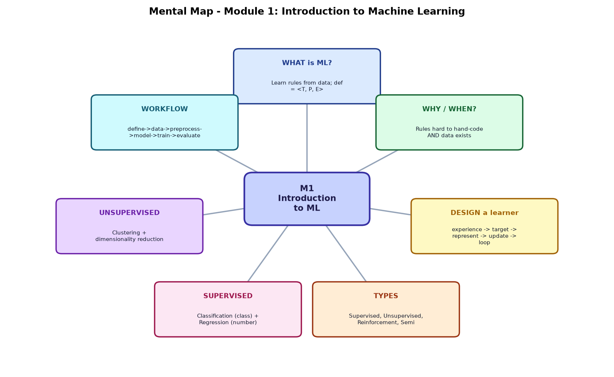
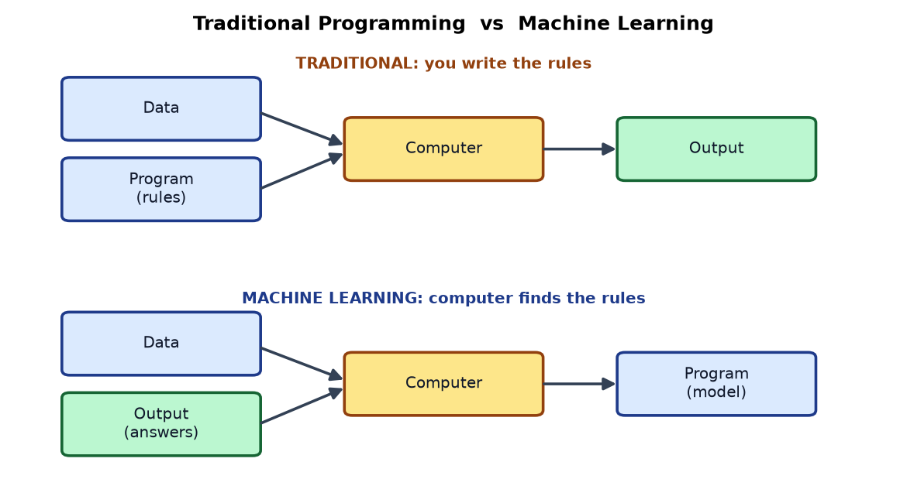
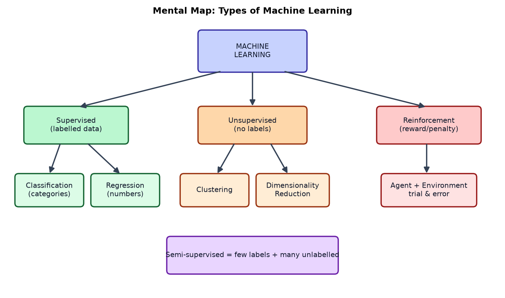
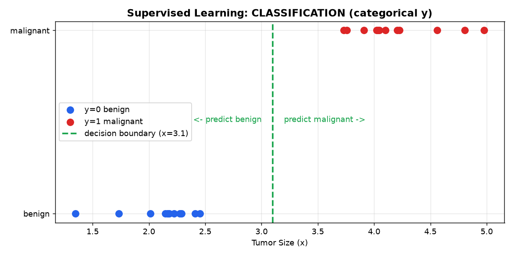
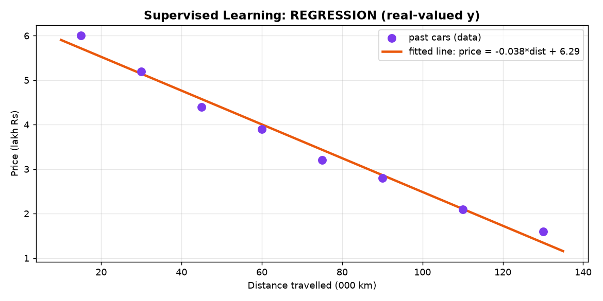
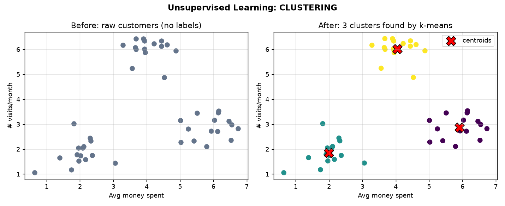
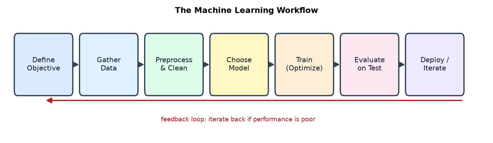

# Module 1 — Introduction to Machine Learning
### A Beginner's Deep-Dive Study Guide (built from your BITS AIML ZG565 handout + Module 1 slides)

> **Textbook anchors** (from your handout):
> **T1** = Tom M. Mitchell, *Machine Learning* (1997) — **Chapter 1** is our main source for Module 1.
> **R1** = Christopher Bishop, *Pattern Recognition and Machine Learning* (2006).
> **R2** = Tan, Steinbach, Kumar, *Introduction to Data Mining*.
> Session 1 of your course = *"Objective, what is ML, application areas, why ML is important, Design a Learning System, Issues in ML"* → this whole guide covers exactly that.

---

## How to use this guide
Read top to bottom. Every section has **(1) a plain-English idea → (2) a formal definition → (3) a mental map / diagram → (4) a worked example → (5) Python you can run.**
Don't rush the math; each symbol is explained in words the first time it appears.

All diagrams referenced below live in the `images/` folder next to this file.
All runnable code lives in `Module1_examples.py` (run it with `python Module1_examples.py`).

---

## 🗺️ Bird's-eye Mental Map (start here)
Glance at this before diving in — it shows how every piece of Module 1 connects.



---

## Table of Contents
0. [Roadmap of Module 1](#0-roadmap)
1. [What is Machine Learning?](#1-what-is-machine-learning)
2. [Why and When do we use ML?](#2-why-and-when)
3. [Designing a Learning System (Mitchell's 5 steps)](#3-designing-a-learning-system)
4. [Types of Machine Learning](#4-types-of-machine-learning)
   - 4.1 Supervised → Classification
   - 4.2 Supervised → Regression
   - 4.3 Unsupervised → Clustering
   - 4.4 Reinforcement Learning
   - 4.5 Semi-supervised Learning
   - 4.6 Other groupings (batch/online, instance/model-based)
5. [Core vocabulary (features, labels, model...)](#5-core-vocabulary)
6. [A pinch of math you need](#6-a-pinch-of-math)
7. [The ML Workflow](#7-the-ml-workflow)
8. [Challenges / Issues in ML](#8-challenges-in-ml)
9. [Tools of the trade](#9-tools)
10. [Glossary](#10-glossary)
11. [Self-check questions (with answers)](#11-self-check)

---

<a name="0-roadmap"></a>
## 0. Roadmap of Module 1

Think of Module 1 as answering **five simple questions**:

```
        WHAT is ML?  ──►  WHY/WHEN use it?  ──►  HOW to design a learner?
                                                        │
                                                        ▼
                          WHAT KINDS exist?  ◄──  HOW does the whole workflow run?
```

Everything else (regression, trees, SVM, Bayes...) in later modules are just **specific tools** that fit inside this big picture. Master this map and the rest of the course has a home to live in.

---

<a name="1-what-is-machine-learning"></a>
## 1. What is Machine Learning?

### 1.1 The one-sentence idea
> **Machine Learning = teaching a computer to find patterns/rules *from data* instead of us hand-writing the rules.**

### 1.2 Traditional programming vs Machine Learning (the key mental flip)



| | You give the computer... | Computer produces... |
|---|---|---|
| **Traditional programming** | Data **+ Rules (program)** | Answers (output) |
| **Machine Learning** | Data **+ Answers (labels)** | **Rules (a model)** |

That flip is the whole revolution: in ML we show examples of *inputs and their correct outputs*, and the machine writes the rule itself.

### 1.3 Three official definitions (know all three for the exam)

1. **Casual / Arthur Samuel (1959):**
   *"Field of study that gives computers the ability to learn without being explicitly programmed."*

2. **The science & art definition:**
   *"The science (and art) of programming computers so they can learn from data."*

3. **Engineering / Tom Mitchell (T1, Ch.1) — the one you must memorise:**
   > A computer program is said to **learn** from experience **E** with respect to some task **T** and performance measure **P**, if its performance at tasks in **T**, as measured by **P**, **improves with experience E**.

   A well-defined learning problem is the triple **⟨T, P, E⟩**.

Mental map of Mitchell's definition:

```
        ┌─────────── learns ───────────┐
   E (Experience) ──improves──►  P (Performance)  on  T (Task)
   "the data"                    "the score"          "the job"
```

### 1.4 Worked examples: writing ⟨T, P, E⟩ (straight from your slides)

| # | **T** (Task) | **P** (Performance measure) | **E** (Experience/Data) |
|---|---|---|---|
| 1 | Recognise hand-written words | % of words correctly classified | Database of human-labelled handwriting images |
| 2 | Classify email as spam / legit | % of emails correctly classified | Emails, some labelled by humans |
| 3 | Play checkers | % of games won vs opponents | Games played against itself |
| 4 | Drive on a 4-lane highway | Avg distance driven before a human-judged error | Images + steering commands from a human driver |

**Your turn (try it):** Netflix movie recommendation.
- **T:** suggest movies a user will like.
- **P:** click-through / watch-completion rate of recommendations.
- **E:** history of what users watched and rated.

> 🧠 **Exam tip:** If asked "formulate this as a learning problem", you *must* name all three: T, P, E.

### 1.5 Concrete story — Spam filtering (why ML wins)

**Traditional way:** a human writes rules — "if email contains '4U', 'free', 'credit card' → spam."
- Problem: spammers change words; you end up with a giant, fragile list of rules that is *hard to maintain*.

**ML way:** feed the program thousands of emails labelled *spam* / *ham* (not spam). It **automatically learns** which words/phrases predict spam.
- Result: shorter program, easier to maintain, usually **more accurate**, and it adapts when spammers change tactics.

---

<a name="2-why-and-when"></a>
## 2. Why and When do we use ML?

### 2.1 When ML is the right tool
Use ML when **at least one** of these is true:

- **Humans can't code the rule by hand** — e.g., *what exactly makes a "2" different from a "7"?* You can recognise it instantly but can't write the rule.
- **Human expertise doesn't exist** — e.g., navigating a robot on Mars.
- **Humans can't explain their expertise** — e.g., face/voice recognition (biometrics).
- **The solution must be personalised** — e.g., personalised medicine, recommendations.
- **Patterns hide in huge data** — too big for a human to hand-encode (medical diagnostics).
- **New data keeps arriving** — the system must keep adapting.

### 2.2 When NOT to use ML
If you can solve it exactly and simply with normal code, **don't** use ML.
> You don't need to "learn" to calculate payroll — that's just arithmetic with fixed rules.

Quick decision map:

```
Is there a PATTERN to detect?            No ─► don't use ML
        │ Yes
Can you solve it exactly by hand/math?   Yes ─► just code it (no ML)
        │ No
Do you HAVE (or can get) data?           No ─► get data first
        │ Yes
                 ✔ ML is a good fit
```

### 2.3 The famous "what makes a 2?" picture
It is genuinely hard to state a rule that separates handwritten 2s from 7s across everyone's handwriting — but a model trained on labelled digit images learns it easily. That's the poster-child argument for ML.

---

<a name="3-designing-a-learning-system"></a>
## 3. Designing a Learning System (Mitchell, T1 Ch.1)

Your handout explicitly lists **"Design a Learning System"**. Mitchell teaches it with the **checkers-playing** example. There are **5 design choices**. Learn them as a pipeline:

```
(1) Choose the        (2) Choose the        (3) Choose how to      (4) Choose a           (5) Final
    TRAINING     ──►      TARGET       ──►      REPRESENT      ──►     LEARNING       ──►    SYSTEM
    EXPERIENCE            FUNCTION              the function          ALGORITHM             design
```

### Step 1 — Choose the training experience (E)
Questions to decide:
- **Direct vs indirect feedback?** Direct = "this board move was good/bad." Indirect = only the final win/loss (harder — this is the *credit assignment problem*: which move deserves credit for the win?).
- **How much control** does the learner have over the examples it sees?
- **Does the training data represent the real distribution** it will be tested on? (If it only plays weak opponents, it may fail against strong ones.)

For checkers: **E = games the program plays against itself.**

### Step 2 — Choose the *target function* (what exactly to learn)
We want a function that tells us how good a board is, or what move to make.

- Idea A: `ChooseMove : Board → Move` (given a board, output best move). Hard to learn directly.
- Idea B (better): `V : Board → ℝ` — a function that scores **how good** a board state is (a real number). Then to move, just pick the move leading to the highest-scoring board.

**Ideal target `V(b)` for checkers:**
```
V(b) = +100   if b is a won board
V(b) = -100   if b is a lost board
V(b) =    0   if b is a drawn board
V(b) = V(b')  otherwise, where b' is the best board reachable from b (playing optimally)
```
The catch: this ideal `V` is **not computable** in practice (it needs perfect play). So we learn an **approximation** `V̂` (V-hat).

### Step 3 — Choose a *representation* for the function
How do we write `V̂`? Use a simple **linear combination of board features**:

```
V̂(b) = w0 + w1·x1 + w2·x2 + w3·x3 + w4·x4 + w5·x5 + w6·x6
```
where the **features xᵢ** describe the board, e.g.:
- x1 = number of my pieces, x2 = number of opponent pieces,
- x3 = number of my kings, x4 = opponent kings,
- x5 = my pieces threatened, x6 = opponent pieces threatened.

The **weights wᵢ** are the numbers the machine will *learn*. (This is literally linear regression, which you'll meet in Module 3.)

### Step 4 — Choose the learning algorithm (how to adjust the weights)
- Compare the current estimate `V̂(b)` with a **training value** `V_train(b)`.
- A clever trick (temporal difference): `V_train(b) ≈ V̂(Successor(b))` — the value of a board should equal the value of the board after the next moves.
- Update each weight to reduce the error using the **LMS (Least Mean Squares) rule**:
```
error = V_train(b) − V̂(b)
wᵢ  ←  wᵢ + η · error · xᵢ          (η = small learning rate, e.g. 0.1)
```
Read it as: *"nudge each weight a little in the direction that reduces the error, in proportion to that feature's value."* You'll see this exact idea again as **gradient descent** in Module 3.

### Step 5 — The final design (four modules working in a loop)
```
   ┌──────────────┐  new problem (board)   ┌──────────────┐
   │ Performance  │ ─────────────────────► │  play game   │
   │   System     │ ◄───────────────────── │  produce     │
   └──────┬───────┘   solution trace       │  game history│
          │                                 └──────┬───────┘
          ▼                                        ▼
   ┌──────────────┐    training examples    ┌──────────────┐
   │   Critic     │ ─────────────────────► │  Generalizer │──► updated V̂ (new weights)
   └──────────────┘                         └──────────────┘
```
- **Performance System** – plays using current `V̂`.
- **Critic** – looks at the finished game and produces training examples.
- **Generalizer** – updates the weights (learns).
- **Experiment Generator** – picks the next problem/board to try.

> 🧠 **Takeaway:** *Designing a learner = pick the experience, decide what function to learn, decide how to write it, decide how to update it, then loop.* Almost every ML algorithm you'll study is a variation of these choices.

---

<a name="4-types-of-machine-learning"></a>
## 4. Types of Machine Learning

The single most important mental map of the module:



**Split by "how much supervision (feedback) the learner gets":**

| Type | Feedback | Data looks like | Goal |
|---|---|---|---|
| **Supervised** | Full feedback (correct answers given) | inputs **x** *with* labels **y** | learn x → y mapping |
| **Unsupervised** | No feedback (no answers) | inputs **x** only | find hidden structure |
| **Reinforcement** | Delayed feedback (reward/penalty) | states, actions, rewards | learn best actions over time |
| **Semi-supervised** | A little feedback | few labelled + many unlabelled | best of both |

Formal wording for supervised: given pairs **(x₁,y₁), (x₂,y₂), …, (xₙ,yₙ)**, learn a function **f(x)** that predicts **y** for a new, unseen **x**.

---

<a name="41-classification"></a>
### 4.1 Supervised Learning → **Classification**

**Idea:** predict a **category / label** (a discrete class).
Formally: learn `f(x)` where **y is categorical** (e.g., y ∈ {benign, malignant} or {spam, ham}).
**Goal:** *previously unseen records should be assigned a class as accurately as possible.*



**Everyday examples:** spam filter, face recognition, fraud detection, image labelling, document tagging.

#### Worked example — "Will a candidate get a job offer?" (from your slide)

| S.No | CGPA | Communication | Aptitude | Programming | **Job Offered?** |
|---|---|---|---|---|---|
| 1 | 9.1 | Average | Good | Excellent | **Yes** |
| 2 | 8.4 | Good | Good | Good | **Yes** |
| 3 | 8.3 | Poor | Average | Average | **No** |
| 4 | 7.1 | Average | Good | Average | **No** |
| 5 | 8.2 | Good | Excellent | Excellent | **No** |

- **Features (x):** CGPA, Communication, Aptitude, Programming skills (the "predictors/attributes").
- **Label (y):** Job Offered? → **Yes/No** → this is **categorical**, so it's a **classification** problem.
- The model learns a rule like *"high CGPA + strong programming ⇒ likely Yes"* purely from these rows, then predicts for a **new** candidate.

#### The math intuition (kept gentle)
A classifier tries to draw a **decision boundary** that separates classes. In the 1-D tumor picture, the boundary is a single threshold `x = 3.1`:
```
if tumor_size < 3.1  → predict benign
else                 → predict malignant
```
With more features it becomes a line/plane. **Performance measure P = accuracy** = (correct predictions) / (total predictions).

#### Python (runnable) — a tiny classifier
```python
from sklearn.tree import DecisionTreeClassifier
import numpy as np

# Encode words as numbers: Poor=0, Average=1, Good=2, Excellent=3
# columns: CGPA, Communication, Aptitude, Programming
X = np.array([
    [9.1, 1, 2, 3],
    [8.4, 2, 2, 2],
    [8.3, 0, 1, 1],
    [7.1, 1, 2, 1],
    [8.2, 2, 3, 3],
])
y = np.array(["Yes", "Yes", "No", "No", "No"])   # categorical label

clf = DecisionTreeClassifier(random_state=0).fit(X, y)

# New candidate: CGPA 8.6, Communication Good(2), Aptitude Good(2), Programming Excellent(3)
new_candidate = [[8.6, 2, 2, 3]]
print("Prediction:", clf.predict(new_candidate)[0])
```

---

<a name="42-regression"></a>
### 4.2 Supervised Learning → **Regression**

**Idea:** predict a **number** (a continuous quantity).
Formally: learn `f(x)` where **y is real-valued** (e.g., a price, a temperature, sea-ice extent).
**Goal:** *previously unseen records should be assigned a value as accurately as possible.*



> **Classification vs Regression in one line:**
> *Classification answers "which class?" (Yes/No, cat/dog). Regression answers "how much?" (₹3.5 lakh, 27.4 °C).*

#### Worked example — "Price of a used car" (from your slide)

Features: Brand, Year, Engine capacity, Mileage, Distance travelled, Cab?(Y/N). Label **Price (₹)** is a real number ⇒ **regression**.

Let's do the math on a mini version using just **distance travelled → price**. We fit a straight line:
```
price ≈ m · distance + c
```
- **m** = slope (how much price drops per extra 1000 km), **c** = intercept (price at 0 km).
- We choose m and c to **minimise the Mean Squared Error (MSE)**:
```
MSE = (1/n) · Σ ( yᵢ − (m·xᵢ + c) )²
```
Read it: for each car, take (actual price − predicted price), square it (so + and − errors don't cancel and big errors are punished), then average. Smaller MSE = better line.

Using the 8 points in the diagram, the least-squares line comes out roughly:
```
price ≈ -0.038 · distance + 6.29   (price in lakh ₹, distance in 000 km)
```
So each extra 10,000 km lowers the predicted price by about ₹0.38 lakh.

#### Python (runnable) — linear regression
```python
from sklearn.linear_model import LinearRegression
import numpy as np

dist  = np.array([15,30,45,60,75,90,110,130]).reshape(-1,1)   # 000 km
price = np.array([6.0,5.2,4.4,3.9,3.2,2.8,2.1,1.6])           # lakh Rs

reg = LinearRegression().fit(dist, price)
print("slope m =", round(reg.coef_[0],3), " intercept c =", round(reg.intercept_,2))
print("Predicted price at 100k km:", round(reg.predict([[100]])[0],2), "lakh")
```

---

<a name="43-clustering"></a>
### 4.3 Unsupervised Learning → **Clustering**

**Idea:** the data has **no labels**; the machine must **discover the hidden groups/structure** by itself.
Formally: given **x₁, x₂, …, xₙ (no y's)**, output the hidden structure behind the x's.
**Goal (clustering):** make points **within a cluster** close together (small *intra*-cluster distance) and **different clusters** far apart (large *inter*-cluster distance).



**Everyday examples:** customer/market segmentation, targeted marketing, grouping news articles, recommendation systems, spam filtering.

#### Worked example — "Market segmentation" (from your slide)
A retailer's customers (features: family income, #visits/month, avg money spent, zip code) get grouped into, say, **big / medium / low spenders** — *without anyone labelling them first*. The algorithm finds the groups.

#### The math intuition — k-means in 4 steps
```
1. Pick k (number of clusters). Randomly place k "centroids".
2. ASSIGN: put each point in the cluster of its nearest centroid.
3. UPDATE: move each centroid to the mean of the points assigned to it.
4. Repeat 2–3 until centroids stop moving.
```
"Nearest" uses **Euclidean distance**: distance between point p and centroid μ =
```
d(p, μ) = √( (p₁−μ₁)² + (p₂−μ₂)² + … )
```
k-means minimises total within-cluster squared distance (called **inertia / WCSS**).

#### Python (runnable) — k-means
```python
from sklearn.cluster import KMeans
import numpy as np

# [avg money spent, visits per month]  (no labels!)
X = np.array([[2,2],[2.3,1.8],[6,3],[5.8,3.2],[4,6],[4.2,5.8]])
km = KMeans(n_clusters=3, n_init=10, random_state=0).fit(X)
print("Cluster of each customer:", km.labels_)
print("Centroids:\n", km.cluster_centers_.round(2))
```

> Other unsupervised jobs besides clustering: **dimensionality reduction / visualisation** — PCA, Kernel PCA, LLE, t-SNE (squeeze many features into 2–3 for plotting).

---

<a name="44-reinforcement"></a>
### 4.4 Reinforcement Learning (RL)

**Idea:** an **agent** learns by **trial and error** inside an **environment**. Good actions → **reward**; bad actions → **penalty**. Over time it learns a *strategy (policy)* that maximises long-term reward. There are **no labelled answers** — only feedback that may be **delayed**.

```
        ┌─────────────┐   action   ┌───────────────┐
        │    AGENT    │ ─────────► │  ENVIRONMENT  │
        │ (learner)   │ ◄───────── │               │
        └─────────────┘  reward +  └───────────────┘
                          new state
        Loop: act → observe reward & new state → improve strategy
```

**Key words:** *agent, environment, state, action, reward, policy.*
**Examples:** a robotic dog learning to walk, game-playing AIs (chess, Go), self-driving control, robotics — problems where **decisions are sequential** and the **goal is long-term**.

*Why it's different:* supervised learning is told the right answer each time; RL only gets a score after acting, and must figure out *which* actions led to the reward (again the **credit-assignment** idea).

---

<a name="45-semi-supervised"></a>
### 4.5 Semi-supervised Learning

**Idea:** you have **a little labelled data and a lot of unlabelled data**. Labelling is expensive, so combine both.
**Example:** Google Photos — you tag one photo of a person (label), and it groups all other photos of that person (unlabelled) automatically. It mixes unsupervised grouping with a bit of supervised labelling.

---

<a name="46-other-groupings"></a>
### 4.6 Two more ways to slice ML (from your slides)

**A) By *how* the training data is fed in:**
| Style | How much data per training step | Use when |
|---|---|---|
| **Batch learning** | *all* data at once | data fits in memory, offline |
| **Mini-batch** | a *subset* at a time | large data, GPUs (most common today) |
| **Online / incremental** | *one* instance at a time | streaming data, must adapt live |

**B) By *how* the model generalises:**
| Style | How it predicts | Example |
|---|---|---|
| **Instance-based** | memorise examples, compare a new point to stored ones | k-Nearest Neighbours |
| **Model-based** | learn parameters that summarise a pattern, then predict | Linear/Logistic Regression |

```
Instance-based:  "You look like these 3 past customers → I'll guess the same."
Model-based:     "I learned a formula from all customers → I'll plug you in."
```

---

<a name="5-core-vocabulary"></a>
## 5. Core vocabulary (say these fluently)

Using the job-offer table as a running example:

| Term | Plain meaning | In our example |
|---|---|---|
| **Instance / sample / record** | one row of data | one candidate |
| **Feature / attribute / predictor (x)** | an input column | CGPA, Aptitude… |
| **Label / target / response (y)** | the answer we predict | Job Offered? |
| **Feature vector** | all features of one instance as a list | `[9.1, 1, 2, 3]` |
| **Model** | the learned rule/function f | the trained tree |
| **Training set** | data used to *learn* | rows we fit on |
| **Test set** | unseen data used to *check* | rows held back |
| **Training** | adjusting the model to fit data | `.fit(...)` |
| **Prediction / inference** | using the model on new x | `.predict(...)` |
| **Parameter (weight w)** | a number the model learns | slope m, weights wᵢ |
| **Hyperparameter** | a knob *you* set before training | k in k-means, learning rate η |
| **Generalisation** | doing well on *unseen* data | the real goal! |

Dimensionality note: `x` can be **multi-dimensional** — each dimension is one attribute (tumor example uses *tumor size, clump thickness, cell size, age…*). More features = higher-dimensional space.

---

<a name="6-a-pinch-of-math"></a>
## 6. A pinch of math you actually need (handout Session 2 preview)

You don't need heavy math for Module 1, but these show up everywhere:

- **Linear algebra – the dot product.** A prediction is often `w·x = w1x1 + w2x2 + … + wdxd`. It's just "multiply matching pieces and add."
  Example: `w=[2,-1]`, `x=[3,4]` → `w·x = 2·3 + (-1)·4 = 2`.

- **Calculus – the derivative / gradient.** Tells us the *slope* of the error surface, i.e. which way to nudge weights to reduce error. That's the engine of **gradient descent** (Module 3). The LMS rule in §3.4 is one gradient step.

- **Probability – for Bayesian methods (Module 8).** Core rule, **Bayes' theorem**:
  ```
  P(A | B) = P(B | A) · P(A) / P(B)
  ```
  Read: "probability of A given we saw B." Used to turn evidence into updated belief (e.g., P(spam | words)).

- **Decision & Information theory.** *Entropy* measures "how mixed/uncertain" a set of labels is — the basis of **Decision Trees** (Module 5). Low entropy = pure group.

> You'll get dedicated sessions on these; for now just recognise the names and what each is *for*.

---

<a name="7-the-ml-workflow"></a>
## 7. The Machine Learning Workflow

Every ML project follows the same loop (your slides, "ML workflow"):



**Step-by-step (with the "should I even use ML?" checks):**
1. **Frame the problem / define objective.** Is there a pattern? Can I solve it analytically instead? Do I have data?
2. **Gather & organise data.**
3. **Preprocess, clean, visualise** (Exploratory Data Analysis). Split into **training set** and **test set**; decide how to represent input features & output.
4. **Choose a model** (e.g., linear regression), a **loss function**, and any **regularisation**.
5. **Optimise** — train the model (adjust parameters to minimise loss).
6. **Hyperparameter search** — tune the knobs.
7. **Analyse performance & mistakes** on the test set, then **iterate** back to step 5 (or 3).

#### Worked mini-example — "Predict a car's price from mileage" (slide walk-through)
1. **Objective:** predict resale price.
2. **Data:** past purchase records / a survey.
3. **Preprocess:** split train/test; represent mileage as a number, price as the target.
4. **EDA:** plot mileage vs price (looks like a downward line → good for linear regression).
5. **Model:** linear regression `price = m·mileage + c`.
6. **Evaluate:** measure error (MSE) on the **test set** → this checks **generalisation**.
7. **Optimise:** adjust m, c to lower error; re-test.

> 🧠 The golden rule: **always judge a model on data it has never seen (test set).** Scoring on training data is like grading students on the exact questions they practised — it hides real ability.

---

<a name="8-challenges-in-ml"></a>
## 8. Challenges / Issues in Machine Learning (handout: "Issues in ML")

Beginner-friendly list of what makes ML hard:

- **Not enough / poor-quality data** — ML is data-hungry; garbage in → garbage out.
- **Non-representative data (sampling bias)** — if training data doesn't match the real world, the model fails in practice.
- **Irrelevant features** — feeding useless columns confuses the model (need good *feature selection/engineering*).
- **Overfitting** — model memorises the training data (including noise) and flops on new data. *Too complex.*
- **Underfitting** — model is too simple to capture the pattern. *Too dumb.*
- **Which algorithm / which representation?** — choosing model form, features, and how much prior knowledge to inject.
- **Credit assignment** — in sequential tasks (RL), knowing which earlier action caused the final reward.
- **Evaluation & comparison** — how do we fairly compare models? (Module 11.)
- **Emerging concerns** — **bias, fairness, interpretability** of models (also Module 11).

Over/underfitting picture in words:
```
Underfit  ──────  Good fit  ──────  Overfit
too simple        just right        too complex
high error on     low error on      low error on TRAIN,
train & test      both              high error on TEST
```

---

<a name="9-tools"></a>
## 9. Tools of the trade (from your slides)

- **Language:** Python (your course standard).
- **Scikit-Learn** — the workhorse for classification, regression, clustering, preprocessing, model selection (we used it above).
- **PyTorch / TensorFlow / Keras** — deep learning / neural networks.
- **Weka** (Java), **Apache Mahout**, **Shogun**, **Accord.NET** — other ML toolkits.
- **Environment:** Jupyter Notebook / **Google Colab** (free, cloud, no setup).

Minimal setup to follow this module:
```bash
pip install numpy pandas matplotlib scikit-learn
```

---

<a name="10-glossary"></a>
## 10. Glossary (quick revision)

- **Machine Learning:** programs that improve at task T (measured by P) as they get experience E.
- **Supervised learning:** learn from labelled (x, y) pairs.
- **Unsupervised learning:** find structure in unlabelled x.
- **Reinforcement learning:** learn actions via rewards/penalties.
- **Semi-supervised:** few labels + many unlabelled.
- **Classification:** predict a category (discrete y).
- **Regression:** predict a number (continuous y).
- **Clustering:** group similar unlabelled points.
- **Feature (x):** input attribute. **Label (y):** output to predict.
- **Model / hypothesis:** the learned function f.
- **Parameter:** learned number (weight). **Hyperparameter:** knob you set.
- **Training vs test set:** data to learn on vs data to fairly evaluate on.
- **Loss / cost function:** number measuring how wrong the model is (e.g., MSE).
- **Gradient descent:** iterative method to reduce loss by following its slope.
- **Overfitting/Underfitting:** too complex / too simple.
- **Generalisation:** performance on unseen data (the real goal).
- **Decision boundary:** surface separating predicted classes.
- **Centroid:** the centre (mean) of a cluster.
- **Instance-based vs model-based:** memorise-and-compare vs learn-a-formula.

---

<a name="11-self-check"></a>
## 11. Self-check questions (try, then peek)

1. **Q:** State Mitchell's definition of learning and its three parts.
   **A:** A program learns from experience **E** w.r.t. task **T** and measure **P** if its performance on **T** (measured by **P**) improves with **E**. Parts: ⟨T, P, E⟩.

2. **Q:** You predict tomorrow's temperature (°C). Classification or regression?
   **A:** Regression — the output is a continuous number.

3. **Q:** Group shoppers into segments with no labels — which ML type?
   **A:** Unsupervised learning (clustering).

4. **Q:** Give two situations where ML beats hand-written rules.
   **A:** Handwriting/face recognition (can't state the rule), spam filtering (rules change constantly).

5. **Q:** Difference between a parameter and a hyperparameter?
   **A:** A **parameter** is learned during training (e.g., slope m). A **hyperparameter** is set by you before training (e.g., k in k-means).

6. **Q:** Why evaluate on a test set instead of the training set?
   **A:** To measure **generalisation** — real performance on unseen data and to detect overfitting.

7. **Q:** In the checkers design, why learn `V(board)→score` instead of `board→best move` directly?
   **A:** Scoring boards is easier to represent/learn; you then pick the move leading to the best-scored board.

8. **Q:** Name Mitchell's four modules of a learning system.
   **A:** Performance System, Critic, Generalizer, Experiment Generator.

---

### ✅ What to remember from Module 1 (30-second recap)
- ML = **learn rules from data** (flip of traditional programming). Definition = **⟨T, P, E⟩**.
- Use ML when rules are **hard to hand-code** and **data exists**.
- **Design a learner** = experience → target function → representation → learning rule → loop.
- **Types:** Supervised (**classification**=category, **regression**=number), Unsupervised (**clustering**), Reinforcement (**reward**), Semi-supervised.
- **Workflow:** define → data → preprocess → model → optimise → evaluate on **test set** → iterate.
- **Watch out for:** bad data, overfitting/underfitting, bias/fairness.

*Next up: Module 2 — Machine Learning Workflow in depth (data, preprocessing, metrics).*
