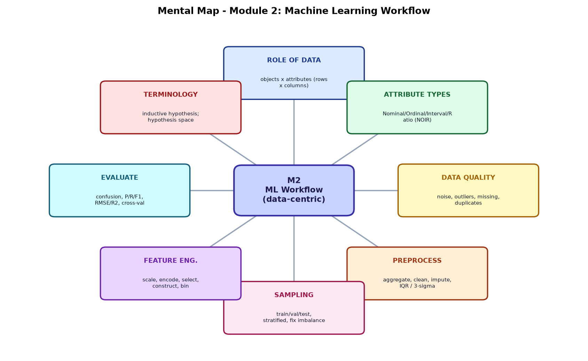
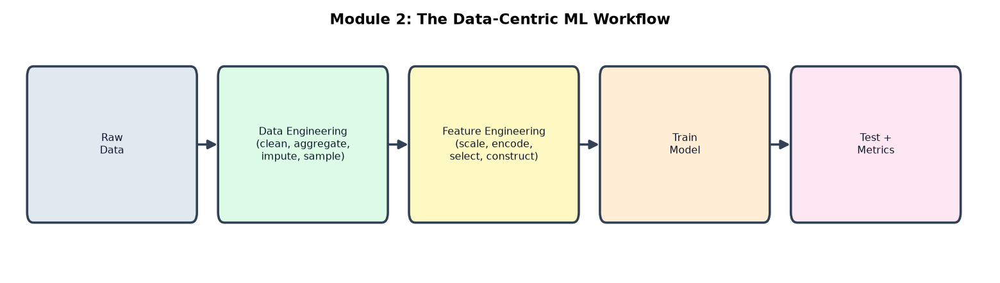
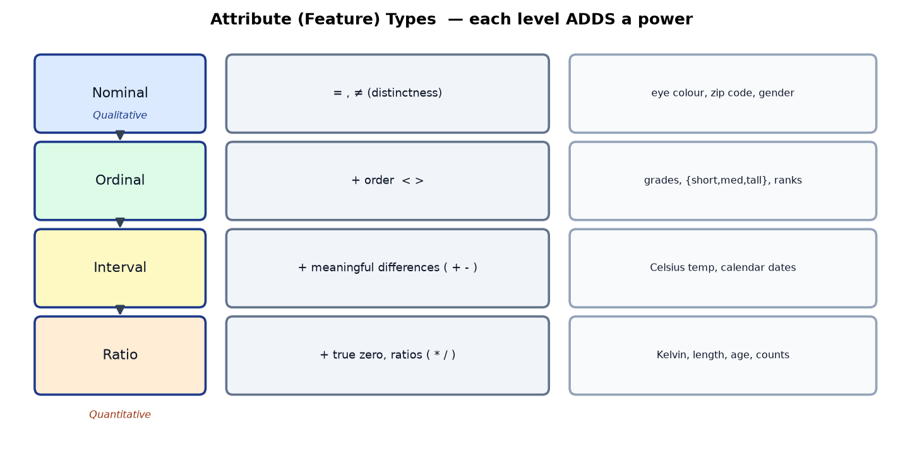
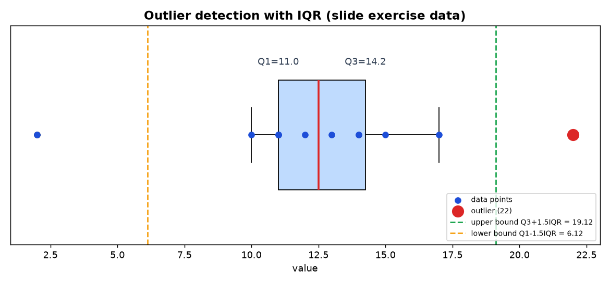
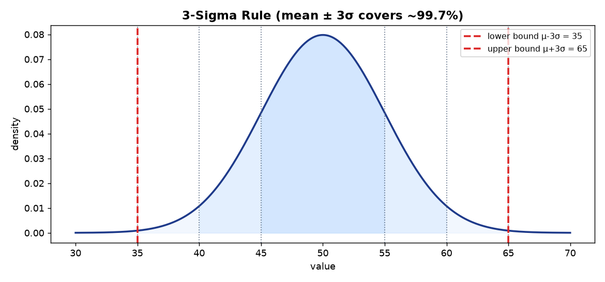
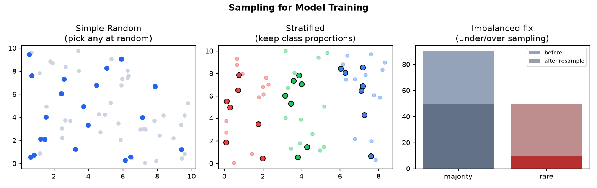
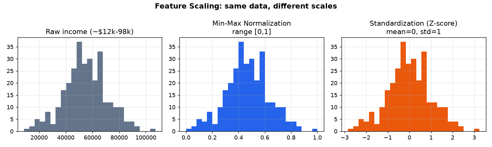

# Module 2 — Machine Learning Workflow
### A Beginner's Deep-Dive Study Guide (BITS AIML ZG565 — Module 2 slides + Contact Session 2)

> **Textbook anchors (your handout):**
> **R2** = Tan, Steinbach, Kumar, *Introduction to Data Mining* — **Ch.2 (Data)** and **Ch.3** are the main source for this module.
> **T1** = Mitchell, *Machine Learning* — Ch.2 for "Concept Learning / Hypothesis" and the *Inductive Learning Hypothesis*.
> Contact Session 2 = *Mathematical Preliminaries* (see the companion file `Module2_MathematicalPreliminaries_Guide.md`) **+** *Machine Learning Workflow* (this file): Role of Data, Pre-processing/wrangling, Data-skewness removal (sampling), Model Training, Model Testing & performance metrics.

---

## How to use this guide
Same recipe as Module 1: **plain idea → definition → mental map → worked example → runnable Python.**
Diagrams are in `images/`. Runnable code is in `Module2_examples.py`.

> 🧠 **Big picture of Module 2:** Module 1 asked *"what is ML?"*. Module 2 answers *"how do I actually prepare data and run the pipeline?"* — and **80% of real ML work is data preparation.**

---

## 🗺️ Bird's-eye Mental Map (start here)
The whole data-centric workflow at a glance:



---

## Table of Contents
0. [Roadmap & "ML in a nutshell"](#0-roadmap)
1. [Role of Data: objects & attributes](#1-role-of-data)
2. [Types of attributes (Nominal/Ordinal/Interval/Ratio)](#2-attribute-types)
3. [Characteristics & types of data](#3-characteristics)
4. [Data Quality problems](#4-data-quality)
5. [Data Pre-processing / wrangling](#5-preprocessing)
   - 5.1 Aggregation
   - 5.2 Cleansing & imputation
   - 5.3 Outlier handling — **IQR** and **3-sigma** (worked)
6. [Instance selection & partitioning (Sampling)](#6-sampling)
7. [Feature tuning — Scaling (Normalization vs Standardization)](#7-scaling)
8. [Feature Engineering (extraction, selection, construction, transform)](#8-feature-engineering)
9. [Model Training, Testing & Performance Metrics](#9-metrics)
10. [Challenges of ML](#10-challenges)
11. [Terminologies: Inductive Learning Hypothesis & Hypothesis space](#11-terminology)
12. [Glossary + Self-check](#12-glossary)

---

<a name="0-roadmap"></a>
## 0. Roadmap & "ML in a nutshell"

**Every ML algorithm has three components** (remember this triple):
```
   1. Data Representation   →   2. Parameter Optimization   →   3. Model Evaluation / Selection
      (how data & model             (learning the best             (measuring & choosing
       are described)                weights)                       the model)
```

**ML in practice is a LOOP:**
```
Understand domain & goals → integrate/clean/preprocess data → learn model parameters
        ▲                                                             │
        └──────────── interpret results ← evaluate ←──────────────────┘
                                deploy the knowledge
```

The whole data-centric workflow of Module 2:



---

<a name="1-role-of-data"></a>
## 1. Role of Data: objects & attributes

Data is stored as a **table**. Learn this vocabulary — the textbook uses many synonyms:

```
                 ATTRIBUTES (columns)
                 ┌────────┬──────────┬──────────┐
   OBJECTS       │ Refund │ Marital  │ Income   │
   (rows)        ├────────┼──────────┼──────────┤
     obj 1  ───► │  Yes   │ Single   │ 125K     │
     obj 2  ───► │  No    │ Married  │ 100K     │
                 └────────┴──────────┴──────────┘
```

| Concept | Definition | Synonyms (all mean the same!) |
|---|---|---|
| **Attribute** | a property/characteristic of an object (e.g., eye colour, temperature) | variable, field, characteristic, **dimension, feature** |
| **Object** | a thing described by a set of attributes | **record, point, case, sample, entity, instance, row** |

> 🧠 So "feature = attribute = column", and "instance = object = record = row". Interviewers and textbooks switch between them freely.

---

<a name="2-attribute-types"></a>
## 2. Types of Attributes (the NOIR ladder)

This is the **most exam-important** part of Module 2 (S. S. Stevens' classification). Each level **adds one power**:



| Type | What it can do | Allowed operations | Examples | Stats you can use |
|---|---|---|---|---|
| **Nominal** | just tells things apart | `= , ≠` (distinctness) | ID numbers, zip codes, eye colour, {male,female} | mode, entropy, χ² test |
| **Ordinal** | tells apart **+ order** | `< , >` | grades, {short,medium,tall}, taste 1–10, ranks | median, percentiles, rank correlation |
| **Interval** | order **+ meaningful differences** | `+ , −` | Celsius/Fahrenheit temp, calendar dates | mean, std-dev, Pearson correlation |
| **Ratio** | differences **+ true zero → ratios** | `× , ÷` | Kelvin, length, age, counts, money | geometric mean, % variation |

**Memory hook: N-O-I-R (like "noir").** Qualitative (Nominal, Ordinal) vs Quantitative (Interval, Ratio).

### The classic "is 10° twice as hot as 5°?" question
- **Celsius / Fahrenheit = Interval** → **NO.** Their zero is arbitrary (0 °C ≠ "no heat"), so ratios are meaningless.
- **Kelvin = Ratio** → **YES.** 0 K is true absolute zero, so 10 K really is twice 5 K.
- Same logic: "Bob is 6 inches above average, Bill 3 inches above average" — *above average* has an arbitrary zero, so Bob is **not** "twice as tall" as Bill. It's an interval-like measurement.

### Allowed transformations (why they matter)
| Type | Transformation that keeps meaning |
|---|---|
| Nominal | any relabeling / permutation (`f` = any 1-to-1 map) |
| Ordinal | any **order-preserving** (monotonic) map — {1,2,3} ≡ {0.5,1,10} |
| Interval | `new = a·old + b` (e.g., °F = 1.8·°C + 32) |
| Ratio | `new = a·old` (e.g., metres → feet) |

### Discrete vs Continuous (a second, independent split)
- **Discrete:** finite/countable values → zip codes, counts, words. (Binary is a special discrete case.) Stored as **integers**.
- **Continuous:** real numbers → temperature, height, weight. Stored as **floats**.

### ✍️ Worked case study (from your slide)
Bank customer table — classify each attribute:

| Attribute | Type | Why |
|---|---|---|
| Name | Nominal | just an identifier |
| Gender | Nominal | categories, no order |
| Service Rating (1–10) | Ordinal | ordered ranks |
| Is Priority Customer? (Yes/No) | Nominal (binary) | two categories |
| Card Type {Platinum, Gold} | Ordinal | there's a rank Platinum > Gold |
| Credit Score (7.5, 8.2 …) | Ratio | real number with true zero |
| Income Level {Upper, Middle, Lower} | Ordinal | ordered categories |
| Region {BGLR, DELHI} | Nominal | no order |

---

<a name="3-characteristics"></a>
## 3. Important characteristics & types of data

**Characteristics that shape your analysis:**
- **Dimensionality** = number of attributes. *High-dimensional data is hard* (see **Curse of Dimensionality**, §8).
- **Sparsity** = most values are zero/absent (e.g., word counts in documents). Only presence counts.
- **Resolution** = the scale you look at; patterns appear/vanish at different scales (per-second vs per-day).
- **Size** = number of records; the type of analysis possible depends on it.

**Data types you'll meet:** Relational/Object, Transactional (market baskets), Document (text), Web & Social-network (graphs), Spatial (maps), Time-series, Sequence data.

---

<a name="4-data-quality"></a>
## 4. Data Quality problems

> **"Garbage in → garbage out."** Poor data silently ruins models. Example: a loan-risk classifier built on bad data denies credit-worthy people and approves defaulters.

Good data is: **Correct, Consistent, Complete, Trustable, Interpretable, Usable-on-demand.**

The five villains:

| Problem | What it is | Example |
|---|---|---|
| **Noise** | random distortion of values | crackle on a phone call, "snow" on a TV |
| **Outliers** | points very different from the rest | Salary = 10000K among ~100K salaries |
| **Missing values** | data not recorded | age left blank; income N/A for a child |
| **Duplicates** | same/near-same record repeated | one person with two email IDs |
| **Wrong / fake data** | invalid or disguised entries | Salary = −10; everyone's birthday = Jan 1 |

**Two faces of outliers:** sometimes they're *noise to remove*; sometimes they're *the goal* (credit-card fraud, intrusion detection).

---

<a name="5-preprocessing"></a>
## 5. Data Pre-processing / wrangling

> Preprocessing = **Data engineering** (raw → clean prepared data) **+ Feature engineering** (prepared → features the model wants).

Four buckets: **Aggregation, Cleansing, Instance selection/partitioning, Feature tuning.**

### 5.1 Aggregation
Combine two+ attributes/objects into one. **Why:** data reduction, change of scale (days→months, cities→regions), and *more stable* data (aggregates have less variability).
```python
# pandas group-by aggregation
df.groupby("region")["sales"].mean()
```

### 5.2 Cleansing & Imputation
Fix **noisy** (Salary=−10), **inconsistent** (Age=42 but Birthday=2010), and **intentional/disguised** (all birthdays Jan 1) records; drop rows missing too many columns; remove duplicates.

**Handling missing values — 3 options:**
1. **Delete** the row/column (only if few are affected).
2. **Impute (estimate)** — fill with mean/median/mode, or a model prediction.
3. **Ignore** it during analysis (some algorithms tolerate gaps).

### 5.3 Outlier handling (univariate) — two standard methods

#### Method A — IQR (Interquartile Range) rule
```
IQR = Q3 − Q1              (Q1 = 25th percentile, Q3 = 75th percentile)
Lower bound = Q1 − 1.5·IQR
Upper bound = Q3 + 1.5·IQR
anything outside [Lower, Upper] is an outlier
```



**✍️ Worked exercise (exact slide numbers):**
Data = `10, 2, 11, 15, 11, 14, 13, 17, 12, 22, 14, 11`
1. **Sort:** 2*, 10, 11, 11, 11, 12, 12, 13, 14, 14, 15, 17, 22 → (slide uses `10,11,11,11,12,12,13,14,14,15,17,22`)
2. **Median (Q2)** = (12+13)/2 = **12.5**
3. **Q1** = **11** (25th percentile)
4. **Q3** = **14.5** (75th percentile)
5. **IQR** = 14.5 − 11 = **3.5**
6. **Lower** = 11 − 1.5·3.5 = **5.75**
7. **Upper** = 14.5 + 1.5·3.5 = **19.75**
→ **22 is the outlier** (it's above 19.75). *(Note: NumPy's default `percentile` uses linear interpolation and gives Q3≈14.25; the conclusion "22 is the outlier" is the same.)*

#### Method B — 3-Sigma rule (Z-score, assumes a Normal/bell curve)
```
Lower bound = μ − 3σ ,  Upper bound = μ + 3σ      (μ=mean, σ=std-dev)
```
~99.7% of a normal distribution lies within μ ± 3σ, so anything outside is a likely outlier.



**✍️ Worked:** μ=50, σ=5 → Lower = 50−15 = **35**, Upper = 50+15 = **65**. Values <35 or >65 are outliers.
The **Z-score** of a point is `z = (v − μ)/σ`; |z| > 3 ⇒ outlier.

---

<a name="6-sampling"></a>
## 6. Instance selection & partitioning — Sampling ("data-skewness removal")

### Train / Validation / Test split
```
┌──────────────────────── all data ────────────────────────┐
│  Training set (learn)  │ Validation (tune) │  Test (final)│
│        ~60-70%         │      ~15-20%       │   ~15-20%    │
└───────────────────────────────────────────────────────────┘
```
- **Training set** → the model *learns* parameters here.
- **Validation set** → *tune* hyperparameters / pick the model here.
- **Test set** → touched **once**, to report honest **generalisation**.

### Why sample at all?
Processing all data can be too expensive/slow. **A sample works almost as well as the full data IF it is *representative*** — i.e., it has roughly the same properties as the whole.

> **Challenge (Module 1 link): Non-representative training data.**
> - Small sample → **sampling noise** (random luck). Fix: increase sample size.
> - Flawed process → **sampling bias** (even a huge sample stays wrong). Fix: fix the process.



### Sampling techniques
| Technique | Idea | When |
|---|---|---|
| **Simple random** | every record equally likely | data is fairly uniform |
| **Stratified** | split into groups (strata), sample each in proportion | preserve class ratios (e.g., IRIS: keep 50/50/50 balance) |
| **Clustered** | sample whole natural clusters | data comes in groups |

**The IRIS pitfall:** plain random subsampling of 150 flowers (50 each) can give an **unbalanced** train/test split (e.g., 38 Setosa but only 28 Versicolor). **Stratified sampling** keeps proportions and avoids this.

### Imbalanced training set
When one class is rare (fraud ≈ 1%), a model can score 99% just by always predicting "not fraud" — useless! Fix by **rebalancing**:
- **Under-sample** the majority class (drop some), or
- **Over-sample** the rare class (duplicate / synthesise, e.g., SMOTE).

---

<a name="7-scaling"></a>
## 7. Feature tuning — Feature Scaling

**Why:** features on different ranges (age 0–100 vs income 0–1,00,000) confuse distance- and gradient-based algorithms; income would dominate. Scaling puts them on comparable ranges.
> **Note:** scale the **features**, usually **not** the target `y`. **Fit the scaler on the training set only**, then transform both train and test (so test info doesn't leak).



### Normalization vs Standardization — when to use which
| | **Min-Max Normalization** | **Standardization (Z-score)** |
|---|---|---|
| Formula | see below | see below |
| Output range | bounded, e.g. [0,1] or [−1,1] | unbounded, mean 0, std 1 |
| Use when | approx min/max known, ~uniform data (e.g. age); algorithms make **no** distribution assumption (KNN, NN) | algorithm assumes **Gaussian** data; **less affected by outliers** |
| Avoid when | skewed data (e.g. income) | — |

#### Min-Max Normalization
```
v' = (v − minA)/(maxA − minA) · (new_max − new_min) + new_min
```
**✍️ Worked (slide):** income range \$12,000–\$98,000, target [0.0, 1.0], value \$73,600:
```
v' = (73,600 − 12,000)/(98,000 − 12,000) · (1 − 0) + 0
   = 61,600 / 86,000 = 0.716
```

#### Z-score Standardization
```
v' = (v − μ)/σ
```
**✍️ Worked (slide):** μ = 54,000, σ = 16,000, value \$73,600:
```
v' = (73,600 − 54,000)/16,000 = 19,600/16,000 = 1.225
```

#### Decimal scaling
```
v' = v / 10^j ,  where j is the smallest integer with max(|v'|) < 1
```
E.g., values in −986…917 → divide by 1000 → −0.986…0.917.

---

<a name="8-feature-engineering"></a>
## 8. Feature Engineering

> Building a **good set of features** is often what decides success. Four activities:

### 8.1 Feature **Extraction** (create fewer, richer features)
Reduce dimensions by building new lower-dimensional features.
**Curse of Dimensionality:** as the number of features grows, the space becomes **increasingly sparse** — points are all "far apart," so models need exponentially more data. **Fix:** dimensionality reduction, e.g. **PCA** (Principal Component Analysis).

### 8.2 Feature **Selection** (keep a useful subset)
Drop **redundant** and **irrelevant** features, and columns with too many missing values.
```python
df = df.drop(["ColA", "ColB"], axis=1)
```

### 8.3 Feature **Construction** (combine to make better ones)
- **Polynomial expansion** (x, x², x³ …),
- **Feature crossing** (capture interactions, e.g., `city × month`),
- **Domain/business logic** (e.g., `is_eligible = CGPA ≥ 6 AND all_sems_complete`).

### 8.4 Feature **Transformation**

**(a) Discretization / Binning** — turn a continuous attribute (age) into discrete bins.
*Why:* Naïve Bayes, Decision Trees/Random Forests, KNN prefer discrete features; also tames outliers.
| Binning | How | Note |
|---|---|---|
| **Equal-width** | split range into N equal-size intervals: `W = (max − min)/N` | simple; **outliers/skew dominate** |
| **Equal-depth (frequency)** | N bins each with ≈ equal count | better for skewed data |

**✍️ Worked equal-width:** ages 0–100 into N=5 bins → W = (100−0)/5 = **20** → bins [0–20),[20–40),[40–60),[60–80),[80–100].

**(b) Encoding categorical features into numbers:**
- **One-Hot / Dummy encoding** → one binary column per category (best for **nominal**, no fake order).
  `Color={Red,Green,Blue}` → `is_Red, is_Green, is_Blue`.
- **Label encoding** → map each category to an integer (ok for **ordinal**: Low=0,Med=1,High=2).

> ⚠️ Don't label-encode a *nominal* feature with an arbitrary order — the model will invent a fake ranking.

---

<a name="9-metrics"></a>
## 9. Model Training, Testing & Performance Metrics

*(Your handout lists these under Session 2; the slides say details come in later modules — here's the beginner foundation.)*

### 9.1 Training vs Testing
- **Training** = fit parameters to minimise a **loss** on the training set.
- **Testing** = measure performance on **unseen** data → the true test of **generalisation**.

### 9.2 Classification metrics — start with the Confusion Matrix
```
                 Predicted +      Predicted −
Actual +      TP (true pos)     FN (false neg)
Actual −      FP (false pos)    TN (true neg)
```
| Metric | Formula | Reads as |
|---|---|---|
| **Accuracy** | (TP+TN)/(TP+TN+FP+FN) | overall % correct |
| **Precision** | TP/(TP+FP) | of predicted positives, how many were right |
| **Recall (Sensitivity)** | TP/(TP+FN) | of actual positives, how many we caught |
| **F1-score** | 2·(P·R)/(P+R) | harmonic mean of precision & recall |

> ⚠️ On **imbalanced** data, accuracy lies (99% by predicting the majority). Use **precision/recall/F1**.

**✍️ Worked:** 100 emails, 20 spam. Model flags 18 as spam: 15 truly spam (TP), 3 not (FP); missed 5 spam (FN); 77 correct ham (TN).
- Accuracy = (15+77)/100 = **0.92**
- Precision = 15/(15+3) = **0.833**
- Recall = 15/(15+5) = **0.75**
- F1 = 2·(0.833·0.75)/(0.833+0.75) = **0.79**

### 9.3 Regression metrics
| Metric | Formula | Note |
|---|---|---|
| **MAE** | mean(\|y − ŷ\|) | avg absolute error, same units |
| **MSE** | mean((y − ŷ)²) | punishes big errors |
| **RMSE** | √MSE | back to original units |
| **R²** | 1 − SS_res/SS_tot | 1 = perfect, 0 = no better than mean |

### 9.4 Cross-validation (k-fold)
Split data into k folds; train on k−1, test on the held-out fold; rotate; average. Gives a **more reliable** score than a single split.
```
Fold1  Fold2  Fold3  Fold4  Fold5
[test][train][train][train][train]   → score1
[train][test][train][train][train]   → score2 ...  average all k
```

---

<a name="10-challenges"></a>
## 10. Challenges of Machine Learning (recap)

- **Training data:** *insufficient* (too little) or *non-representative* (biased sample).
- **Model selection:** **overfitting** (memorises noise — great on train, bad on test) vs **underfitting** (too simple — bad on both).
- **Validation & testing:** must evaluate honestly on unseen data.

```
Underfitting  ───────────  Just right  ───────────  Overfitting
(too simple)                (good)                    (too complex)
```
> **Trade-off:** With little data, sometimes a *simpler* algorithm beats a fancy one ("algorithm vs data readiness").

---

<a name="11-terminology"></a>
## 11. Terminologies (to read the textbook — T1)

### Inductive Learning Hypothesis
> *Any hypothesis that approximates the target function well over a **sufficiently large** set of training examples will also approximate it well over **unseen** examples.*

Meaning: **if it fits enough training data well, we trust it to generalise.** That trust is what makes learning-from-examples ("induction") possible.

**Inductive learning = prediction:** given examples `(X, F(X))`, predict `F(X)` for new `X`.
- **Classification:** `F(X)` is **discrete** (a class).
- **Regression:** `F(X)` is **continuous** (a number).
- **Probability estimation:** `F(X)` is a **probability**.

### Hypothesis & Hypothesis space
A **hypothesis `h`** is one candidate rule the learner considers. Using the *EnjoySport* style attributes `(Sky, AirTemp, Humidity, Wind, Water, Forecast)`:
- A hypothesis is a vector of constraints, where `?` = "any value", `∅` = "no value accepted".
- Example hypothesis: `(?, Cold, High, ?, ?, ?)` → "positive whenever AirTemp=Cold and Humidity=High, regardless of the rest."
- **Most general** hypothesis: `(?, ?, ?, ?, ?, ?)` → everything is positive.
- **Most specific** hypothesis: `(∅, ∅, ∅, ∅, ∅, ∅)` → nothing is positive.

```
   MOST SPECIFIC                                    MOST GENERAL
   (∅,∅,∅,∅,∅,∅)  ── learning searches between ──►  (?,?,?,?,?,?)
   "accept nothing"                                  "accept everything"
```
Learning = **searching this space** for an `h` consistent with the training data.

---

<a name="12-glossary"></a>
## 12. Glossary (quick revision)

- **Object/instance/record:** one row. **Attribute/feature:** one column.
- **Nominal/Ordinal/Interval/Ratio:** categories / +order / +differences / +true-zero.
- **Discrete vs Continuous:** countable vs real-valued.
- **Noise, Outlier, Missing, Duplicate:** the data-quality villains.
- **Imputation:** filling in missing values.
- **IQR rule:** outlier if outside Q1−1.5·IQR … Q3+1.5·IQR.
- **3-sigma rule:** outlier if outside μ ± 3σ.
- **Sampling:** simple-random / stratified / clustered.
- **Imbalanced data:** under-sample majority or over-sample rare class.
- **Normalization (min-max):** scale to [0,1]. **Standardization (z-score):** mean 0, std 1.
- **Curse of dimensionality:** too many features → sparse space → need more data.
- **PCA:** dimensionality-reduction (feature extraction).
- **Discretization/Binning:** continuous → discrete (equal-width / equal-depth).
- **One-hot vs Label encoding:** binary columns per category vs integer per category.
- **Confusion matrix / Precision / Recall / F1:** classification metrics.
- **MAE / MSE / RMSE / R²:** regression metrics.
- **Cross-validation:** rotate train/test folds, average scores.
- **Inductive Learning Hypothesis:** fits enough training data ⇒ generalises.
- **Hypothesis space:** all candidate rules, from most-specific to most-general.

### Self-check (try, then peek)
1. **Q:** Zip code — which attribute type? **A:** Nominal (it's an identifier; arithmetic is meaningless).
2. **Q:** Is 40 °C twice as hot as 20 °C? **A:** No — Celsius is interval (arbitrary zero). In Kelvin, yes.
3. **Q:** Given Q1=11, Q3=14.5, is 22 an outlier by IQR? **A:** Yes; upper bound = 14.5+1.5·3.5 = 19.75 < 22.
4. **Q:** Skewed income — normalize or standardize? **A:** Prefer standardization (less affected by outliers/skew).
5. **Q:** Nominal colour feature — one-hot or label encode? **A:** One-hot (label encoding invents a fake order).
6. **Q:** Why is accuracy misleading on fraud data? **A:** Rare positive class — always predicting "no fraud" scores high but catches none; use precision/recall/F1.
7. **Q:** Fit the scaler on which set? **A:** Training set only, then transform train + test.

### ✅ 30-second recap
- **3 components** of any ML algo: representation, optimization, evaluation.
- Know **NOIR** attribute types and their allowed operations.
- **Clean** data (noise/outliers/missing/duplicates); handle outliers with **IQR** or **3σ**.
- **Sample** representatively; use **stratified** splits; fix **imbalance**.
- **Scale** features (min-max vs z-score) and **engineer** them (select/construct/encode/bin).
- **Evaluate** with confusion-matrix metrics (classification) or MAE/RMSE/R² (regression), using **cross-validation**.
- **Inductive Learning Hypothesis:** fit enough data well ⇒ generalise; learning = searching the **hypothesis space**.

*Companion file: `Module2_MathematicalPreliminaries_Guide.md` (linear algebra, calculus, probability, decision & information theory).*
