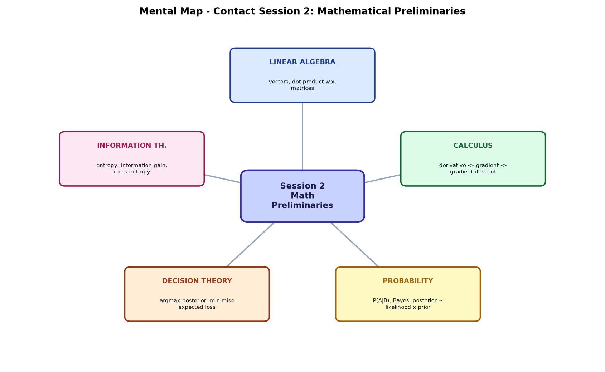
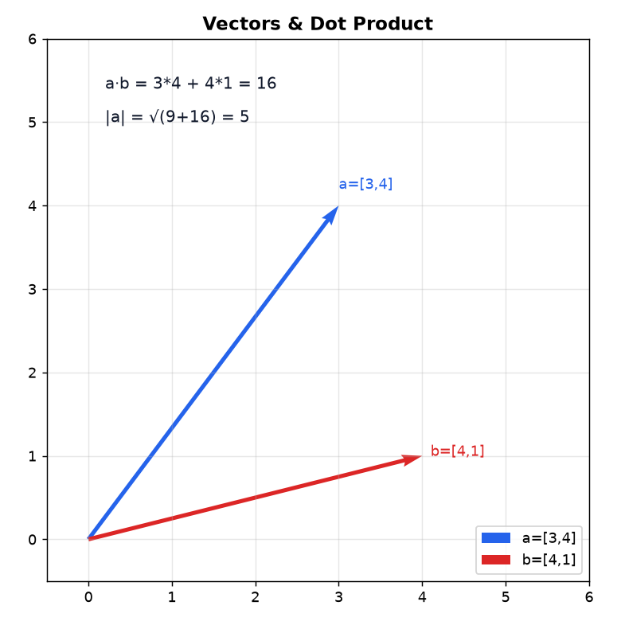
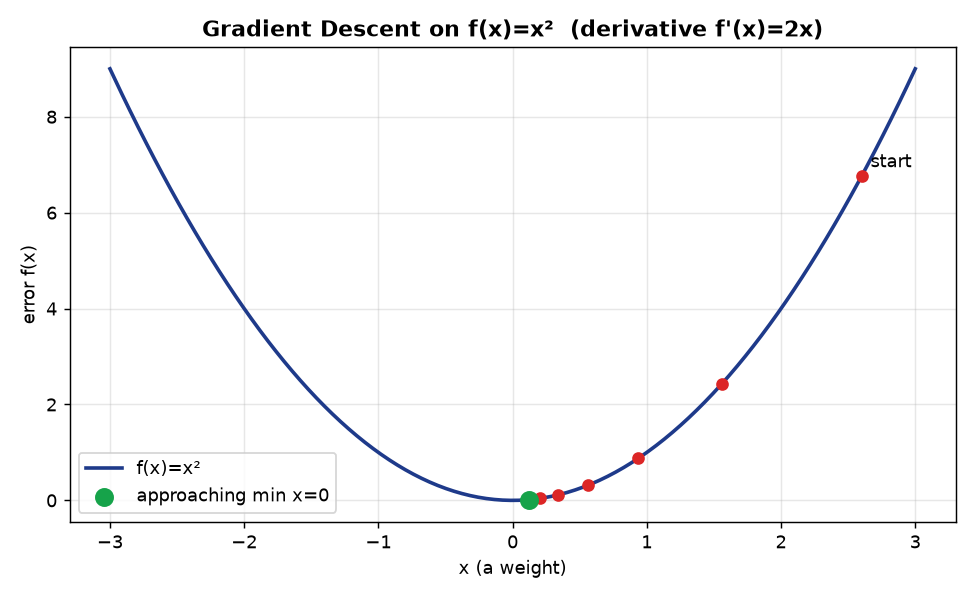
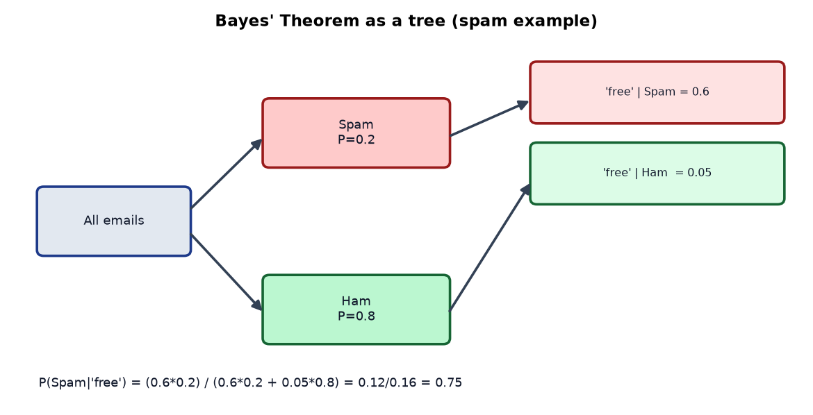
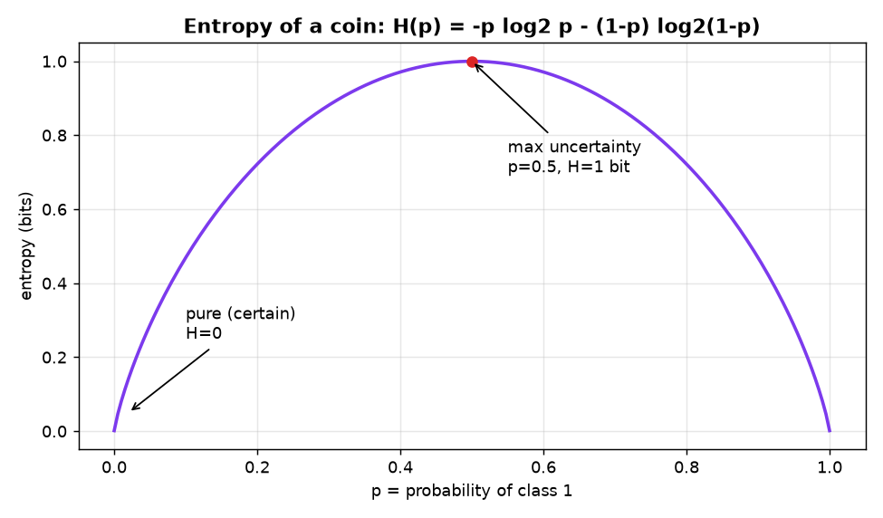

# Module 2 (Contact Session 2) — Mathematical Preliminaries
### A Beginner's Deep-Dive Study Guide (BITS AIML ZG565)

> **Handout, Contact Session 2:** *"Mathematical Preliminaries — Linear Algebra, Calculus, Probability theory, Decision Theory, Information Theory"* (R2 Ch.2–3 + Lecture Notes).
> **Textbook anchors:** **R1** = Bishop *PRML* Ch.1 (probability, decision theory, information theory); **R2** = Tan *Intro to Data Mining*.
> This is the **companion** to `Module2_MachineLearningWorkflow_Guide.md`.

---

## Why this matters (read first)
You do **not** need to be a mathematician. You need **five small toolkits** so ML formulas stop looking scary:

```
   Linear Algebra ──► "bundle numbers into vectors/matrices & multiply them"
   Calculus       ──► "which way is downhill?" (train models via gradients)
   Probability    ──► "reason under uncertainty" (Bayes, Naive Bayes)
   Decision Theory──► "turn probabilities into the best action"
   Information Th.──► "measure surprise/uncertainty" (entropy → decision trees)
```
Each section below: **plain idea → notation decoded → worked example → Python.**
Diagrams: `images/`. Runnable code: `Module2_examples.py`.

---

## 🗺️ Bird's-eye Mental Map (start here)
The five math toolkits and what each is for:



---

## Table of Contents
1. [Linear Algebra](#1-linear-algebra)
2. [Calculus & Gradients](#2-calculus)
3. [Probability Theory](#3-probability)
4. [Decision Theory](#4-decision-theory)
5. [Information Theory](#5-information-theory)
6. [Glossary + Self-check](#6-glossary)

---

<a name="1-linear-algebra"></a>
## 1. Linear Algebra — "math with lists of numbers"

### 1.1 Scalars, Vectors, Matrices
| Object | What it is | Example | ML meaning |
|---|---|---|---|
| **Scalar** | a single number | `5` | one value (a price) |
| **Vector** | an ordered list of numbers | `x = [3, 4]` | **one data instance's features** |
| **Matrix** | a grid (rows × columns) | `[[1,2],[3,4]]` | **whole dataset** (rows=instances, cols=features) |

Notation decoded: `x ∈ ℝ³` means "x is a vector of 3 real numbers." A dataset `X ∈ ℝ^{n×d}` = n rows, d features.

### 1.2 Vector operations
- **Add:** `[1,2] + [3,4] = [4,6]` (element-wise).
- **Scale:** `3·[1,2] = [3,6]`.
- **Length (norm):** `|x| = √(x₁² + x₂² + …)`. For `x=[3,4]`, `|x| = √(9+16) = 5`.

### 1.3 The Dot Product (the single most-used operation in ML)
```
a · b = a₁b₁ + a₂b₂ + … + a_d b_d      → a single number
```
Read: *"multiply matching entries, then add them all up."*



**✍️ Worked:** `a=[3,4]`, `b=[4,1]` → `a·b = 3·4 + 4·1 = 12 + 4 = 16`.

**Why ML loves it:** almost every linear model prediction is a dot product of **weights** `w` and **features** `x`:
```
prediction  ŷ = w·x + b = w₁x₁ + w₂x₂ + … + b
```
That's linear/logistic regression, SVMs, and one neuron of a neural net — all the same shape.

### 1.4 Matrix × vector (many predictions at once)
Multiply the whole dataset by the weights to score every row in one shot:
```
X (n×d) · w (d×1) = ŷ (n×1)
```
Rule: **inner dimensions must match** (d = d). Output takes the outer dimensions (n×1).

### 1.5 A few named ideas you'll hear later
- **Transpose `Aᵀ`:** flip rows↔columns.
- **Identity `I`:** the "1" of matrices (`A·I = A`).
- **Inverse `A⁻¹`:** the "reciprocal" (`A·A⁻¹ = I`) — used in the *closed-form* solution of linear regression (Module 3): `w = (XᵀX)⁻¹Xᵀy`.
- **Eigenvectors/eigenvalues:** special directions that don't rotate — the engine of **PCA** (Module 2 feature extraction / Module 10).

```python
import numpy as np
a = np.array([3, 4]); b = np.array([4, 1])
print(a @ b)            # dot product -> 16
print(np.linalg.norm(a))  # length -> 5.0
X = np.array([[1, 2], [3, 4], [5, 6]]); w = np.array([0.5, -1.0])
print(X @ w)            # 3 predictions at once
```

---

<a name="2-calculus"></a>
## 2. Calculus & Gradients — "which way is downhill?"

### 2.1 The derivative = slope = rate of change
The derivative `f'(x)` (also `df/dx`) tells you **how fast f changes** and **in which direction it rises**.
- `f(x) = x²` → `f'(x) = 2x`. At `x=3`, slope = 6 (rising steeply); at `x=0`, slope = 0 (a flat minimum).

**Rules you'll actually use:**
| f(x) | f'(x) |
|---|---|
| constant `c` | 0 |
| `xⁿ` | `n·xⁿ⁻¹` |
| `c·g(x)` | `c·g'(x)` |
| `g(x)+h(x)` | `g'(x)+h'(x)` |

### 2.2 Gradient = derivative for many variables
When a function has several inputs (like many weights), the **gradient `∇f`** is the vector of partial derivatives — one slope per weight. It points in the direction of **steepest increase**; the **negative gradient points downhill**.

### 2.3 Gradient Descent — how models learn
To minimise error, take repeated small steps **downhill**:
```
w ← w − η · f'(w)          (η = learning rate, a small positive number)
```
Read: *"move each weight opposite to its slope; big slope → big step."*



**✍️ Worked (minimise `f(w)=w²`, start w=2.6, η=0.2):**
```
step1: w = 2.6 − 0.2·(2·2.6) = 2.6 − 1.04 = 1.56
step2: w = 1.56 − 0.2·(3.12) = 0.936
step3: w = 0.936 − 0.2·(1.872) = 0.562  ...  → heads toward 0 (the minimum)
```
This is exactly the **LMS/gradient step** you saw in Module 1's checkers design and will formalise in Module 3.

```python
w, eta = 2.6, 0.2
for i in range(6):
    grad = 2 * w            # derivative of w^2
    w = w - eta * grad
    print(round(w, 4))
```

> **Learning-rate intuition:** too small → learns painfully slowly; too big → overshoots and may diverge. It's a **hyperparameter** you tune.

---

<a name="3-probability"></a>
## 3. Probability Theory — "reasoning under uncertainty"

### 3.1 The basics
- **Probability `P(A)`** ∈ [0,1]: 0 = impossible, 1 = certain. All outcomes sum to 1.
- **Joint `P(A,B)`:** both A and B happen.
- **Conditional `P(A|B)`:** probability of A **given** B already happened. `P(A|B) = P(A,B)/P(B)`.
- **Independence:** A, B independent ⇔ `P(A,B) = P(A)·P(B)`.

**✍️ Worked (dice):** `P(even) = 3/6 = 0.5`. `P(roll > 4) = P(5 or 6) = 2/6 = 0.333`.

### 3.2 The two rules everything is built from
- **Sum rule:** `P(A) = Σ_b P(A, B=b)` (marginalise out B).
- **Product rule:** `P(A,B) = P(A|B)·P(B)`.

### 3.3 Bayes' Theorem (the heart of Module 8)
```
              P(B|A) · P(A)
   P(A|B) =  ───────────────
                  P(B)

   posterior = (likelihood × prior) / evidence
```
Decoded: start with a **prior** belief `P(A)`, see **evidence** `B`, update to a **posterior** `P(A|B)`.



**✍️ Worked (spam):** 20% of email is spam. The word *"free"* appears in 60% of spam but only 5% of ham. An email contains *"free"* — is it spam?
```
P(Spam)=0.2, P(Ham)=0.8, P(free|Spam)=0.6, P(free|Ham)=0.05
P(free) = 0.6·0.2 + 0.05·0.8 = 0.12 + 0.04 = 0.16      (sum rule)
P(Spam|free) = (0.6·0.2)/0.16 = 0.12/0.16 = 0.75
```
So seeing *"free"* raises spam-belief from 20% → **75%**. That's a spam filter in one line — and the basis of the **Naïve Bayes classifier**.

### 3.4 Random variables & distributions (names to know)
- **Discrete:** **Bernoulli** (one coin flip), **Binomial** (n flips), **Categorical** (a die).
- **Continuous:** the **Normal/Gaussian** `N(μ, σ²)` — the bell curve, defined by mean μ and variance σ².
- **Expectation `E[X]`** = the long-run average (`Σ x·P(x)`). **Variance `Var(X)=E[(X−μ)²]`** = spread.

```python
# Bayes in code
P_spam, P_ham = 0.2, 0.8
P_free_spam, P_free_ham = 0.6, 0.05
P_free = P_free_spam*P_spam + P_free_ham*P_ham
print("P(Spam|free) =", round(P_free_spam*P_spam / P_free, 3))   # 0.75
```

---

<a name="4-decision-theory"></a>
## 4. Decision Theory — "from probabilities to the best action"

Probability tells you *how likely*; **decision theory tells you *what to do*.**

### 4.1 Simplest rule — pick the most probable class (MAP decision)
After computing posteriors, **choose the class with the highest posterior probability**:
```
predict  argmax_k  P(class_k | x)
```
**✍️ Worked:** if `P(Spam|x)=0.75` and `P(Ham|x)=0.25`, predict **Spam** (0.75 > 0.25).
This minimises the **probability of misclassification**.

### 4.2 But not all mistakes cost the same — the Loss/Cost matrix
A **false negative** (miss a cancer) is far worse than a **false positive** (extra test). We encode costs and **minimise expected loss (risk)**:
```
Expected loss of action a  =  Σ_k  Loss(a, class_k) · P(class_k | x)
                              (choose the action with the smallest expected loss)
```
**✍️ Worked (medical):** costs — miss disease (FN)=100, false alarm (FP)=1.
A patient has `P(disease|x)=0.10`.
- **Predict "healthy"** → expected loss = 100·0.10 = **10**.
- **Predict "disease"** → expected loss = 1·0.90 = **0.9**.
→ Even though disease is only 10% likely, **predict "disease"** (0.9 < 10). High miss-cost shifts the decision.

### 4.3 The reject option
If the top posterior isn't confident enough (e.g., < 0.6 for any class), **abstain / defer to a human** — common in medical and fraud systems.

---

<a name="5-information-theory"></a>
## 5. Information Theory — "measuring uncertainty / surprise"

This underpins **Decision Trees** (Module 5).

### 5.1 Information content = surprise
A **rare** event carries more information than a common one. For an event of probability `p`:
```
information(x) = − log₂ p        (bits)
```
- Certain event (`p=1`) → `−log₂1 = 0` bits (no surprise).
- Coin lands heads (`p=0.5`) → `−log₂0.5 = 1` bit.

### 5.2 Entropy = average surprise of a whole distribution
```
H(X) = − Σ_k  p_k · log₂ p_k      (bits)
```
Read: *"how mixed/uncertain is this set of outcomes?"* High entropy = very unpredictable; **zero entropy = perfectly pure/certain.**



**✍️ Worked (a coin / binary label):**
- Fair (`p=0.5`): `H = −(0.5·log₂0.5 + 0.5·log₂0.5) = −(−0.5 −0.5) = 1` bit → **max uncertainty**.
- Biased (`p=0.9`): `H = −(0.9·log₂0.9 + 0.1·log₂0.1) = −(0.9·(−0.152) + 0.1·(−3.322)) = 0.469` bits.
- Pure (`p=1`): `H = 0` bits.

**✍️ Worked (a group of labels):** a node has 9 "Yes" and 5 "No" (14 total):
```
p_yes = 9/14 = 0.643 ,  p_no = 5/14 = 0.357
H = −(0.643·log₂0.643 + 0.357·log₂0.357)
  = −(0.643·(−0.637) + 0.357·(−1.486)) = 0.409 + 0.531 = 0.940 bits
```

### 5.3 Information Gain (why trees split where they do)
A decision tree picks the feature that **reduces entropy the most**:
```
Information Gain = H(parent) − Σ (weighted H of children)
```
Bigger drop in uncertainty ⇒ better split. (Full treatment in Module 5.)

### 5.4 KL divergence & cross-entropy (names for later)
- **Cross-entropy** = the **log-loss** used to train logistic regression / classifiers (Module 4).
- **KL divergence `D(p‖q)`** = how far distribution `q` is from `p`.

```python
import numpy as np
def entropy(probs):
    probs = np.array(probs); probs = probs[probs > 0]
    return -np.sum(probs * np.log2(probs))
print(round(entropy([0.5, 0.5]), 3))     # 1.0
print(round(entropy([9/14, 5/14]), 3))   # 0.94
```

---

<a name="6-glossary"></a>
## 6. Glossary + Self-check

**Glossary**
- **Vector / Matrix:** list / grid of numbers (one instance / whole dataset).
- **Dot product `a·b`:** multiply-matching-and-sum → a number; the core of linear models.
- **Norm `|x|`:** length of a vector.
- **Derivative `f'(x)`:** slope / rate of change.
- **Gradient `∇f`:** vector of slopes; points uphill.
- **Gradient descent:** step downhill `w ← w − η·∇f` to minimise error.
- **Learning rate `η`:** step-size hyperparameter.
- **P(A|B):** conditional probability. **Bayes:** posterior ∝ likelihood × prior.
- **Prior / Likelihood / Posterior / Evidence:** the four parts of Bayes.
- **Expectation `E[X]` / Variance:** average / spread.
- **Gaussian `N(μ,σ²)`:** the bell curve.
- **Decision theory:** choose the action minimising **expected loss (risk)**.
- **Loss/cost matrix:** cost of each type of mistake.
- **Entropy `H`:** average uncertainty (bits); 0 = pure, 1 = fair coin.
- **Information gain:** entropy reduction from a split (drives decision trees).
- **Cross-entropy / log-loss:** classifier training loss.

**Self-check (try, then peek)**
1. **Q:** `a=[2,−1]`, `b=[3,4]`, find `a·b`. **A:** 2·3 + (−1)·4 = **2**.
2. **Q:** `f(w)=w²`, one gradient step from `w=5`, `η=0.1`? **A:** `5 − 0.1·(2·5) = 4`.
3. **Q:** Prior spam 0.2, `P(free|spam)=0.6`, `P(free|ham)=0.05`. `P(spam|free)`? **A:** 0.12/0.16 = **0.75**.
4. **Q:** Entropy of a fair coin? **A:** **1 bit**. Of a certain event? **A:** **0 bits**.
5. **Q:** Disease 10% likely; missing it costs 100, false alarm costs 1. Best action? **A:** Predict **disease** (expected loss 0.9 < 10).
6. **Q:** Which toolkit powers PCA? **A:** Linear algebra (eigenvectors/eigenvalues).

### ✅ 30-second recap
- **Linear algebra:** predictions are **dot products** `w·x`; datasets are matrices.
- **Calculus:** learn by **gradient descent** — step opposite the slope.
- **Probability:** update beliefs with **Bayes** (posterior ∝ likelihood × prior).
- **Decision theory:** pick the action with **least expected loss**, not just the most likely class.
- **Information theory:** **entropy** measures uncertainty; **information gain** builds decision trees.

*Companion file: `Module2_MachineLearningWorkflow_Guide.md`.*
