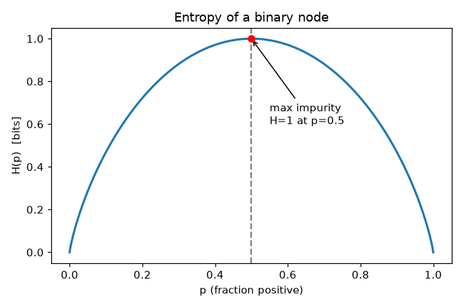
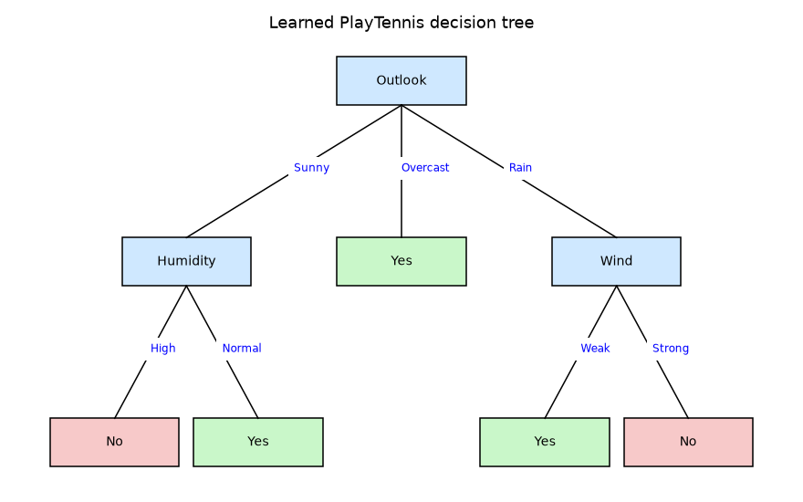
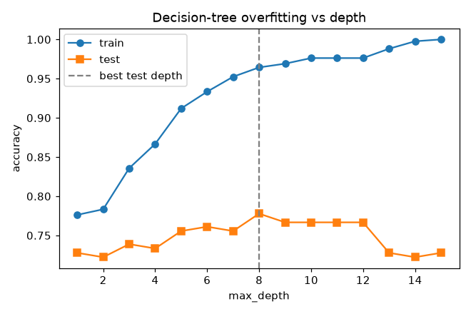

# Module 5 — Decision Trees

### A Beginner's Deep-Dive Study Guide (BITS AIML ZG565 — Contact Session 6)

> **Handout, Session 6:** *Information Theory, Entropy Based Decision Tree Construction, Avoiding Overfitting, Minimum Description Length, Handling Continuous valued attributes, missing attributes* → **T1 (Mitchell) Ch.3, R2 (Tan) Ch.3**.
> Built from the handout topic list + Mitchell Ch.3 + the course "Decision Trees" slides, in the same format as your Module 1–4 guides.

---

## How to use this guide
Same recipe: **plain idea → definition → mental map → worked example → runnable Python.**
Diagrams: `images/`. Runnable, verified code: `Module5_examples.py`.
Builds directly on **Module 2's Information Theory** (entropy, information gain) and continues the supervised-learning story after **Module 4 (linear classifiers)** — but now the boundary is a set of **if-then rules** instead of a hyperplane.

> 🧠 **The whole module in one line:** *Repeatedly split the data on the attribute that **buys the biggest drop in entropy (information gain)** until each branch is (nearly) pure — then prune back the branches that only memorised noise.*

---

## 🗺️ Bird's-eye Mental Map (start here)

```
                         DECISION TREES (Module 5)
                                   │
      ┌────────────────┬───────────┴───────────┬─────────────────┐
      ▼                ▼                        ▼                 ▼
  WHAT it is      HOW to build            WHEN to stop        EXTENSIONS
  if-then tree    (ID3 / C4.5)            (overfitting)       (real world)
  root→leaf       pick split by           pre-prune /         continuous attrs
  = 1 rule        INFORMATION GAIN        post-prune          missing values
  disjunction     = H(parent) −           MDL principle       gain ratio
  of conjunctions   Σ weightedH(child)    (short trees win)   attribute cost
```
Each node = "test one attribute". Each path root→leaf = one **AND** rule. The whole tree = an **OR** of those rules.

---

## Table of Contents
1. [What is a Decision Tree? (Simple Explanation)](#1-what)
2. [How it works — the ID3 idea](#2-how)
3. [The Math: Entropy & Information Gain (with derivation)](#3-math)
4. [Fully worked tree: PlayTennis](#4-playtennis)
5. [Python Implementation](#5-python)
6. [Overfitting & Pruning](#6-overfit)
7. [Minimum Description Length (MDL)](#7-mdl)
8. [Continuous attributes, Gain Ratio, missing values, costs](#8-extensions)
9. [Worked Examples](#9-worked)
10. [Scenario-Based Questions](#10-scenarios)
11. [Practice Problems](#11-practice)
12. [Key Takeaways · Common Mistakes · Connections · Quick Reference · Glossary + Self-check](#12-wrap)

---

<a name="1-what"></a>
## 1. What is a Decision Tree? (Simple Explanation)

A **decision tree** is just a flowchart of yes/no (or multi-way) questions that ends in a decision. You start at the top (**root**), answer the question at each **internal node**, follow the matching **branch**, and stop at a **leaf** that gives the answer (a class label, or a number for regression).

**Real-world analogy — the "20 Questions" game.** To guess an animal you ask the *most informative* question first ("Is it bigger than a dog?") because it eliminates the most possibilities. A decision tree learns, from data, **which question to ask first** so that after each answer you are as *certain* as possible about the label.

**Why we need it in ML.**
- **Interpretable:** the model *is* a set of human-readable rules ("IF Outlook=Sunny AND Humidity=High THEN No"). Unlike the weights of a linear classifier, a manager can read it.
- **No scaling needed, handles mixed data**, captures **non-linear** and **interaction** effects automatically.
- It's the **building block** of Random Forests and Gradient Boosting (Module 9).

Formally (Mitchell): a decision tree represents a **disjunction of conjunctions of constraints** on attribute values. Each path is a conjunction (AND); the tree is the disjunction (OR) of all paths.

---

<a name="2-how"></a>
## 2. How it works — the ID3 idea

**ID3 / C4.5** (Quinlan) build the tree **top-down, greedily**:

```
ID3(Examples, Target, Attributes):
  1. Create a Root node.
  2. If all Examples are +  → return leaf "+".
     If all Examples are −  → return leaf "−".
     If Attributes is empty → return leaf = majority label.
  3. A ← the attribute with the HIGHEST INFORMATION GAIN on Examples.
  4. For each value v of A:
        add a branch A = v
        Examples_v ← subset with A = v
        if Examples_v empty → leaf = majority label of Examples
        else → attach ID3(Examples_v, Target, Attributes − {A})
  5. Return Root.
```

Key ideas to remember:
- **Greedy hill-climbing:** it never backtracks — it picks the locally best split and moves on (so it can miss the globally smallest tree).
- **Complete hypothesis space:** every discrete function *can* be represented by *some* tree, so the target is always representable.
- **Inductive bias = "prefer short trees"** with high-information attributes near the root (Occam's Razor). This is a **preference bias**, not a restriction bias.

---

<a name="3-math"></a>
## 3. The Math: Entropy & Information Gain

### 3.1 Entropy — how "impure/mixed" is a set?
For a set `S` with class proportions `p₁,…,p_c`:
$$H(S) = -\sum_{k=1}^{c} p_k \log_2 p_k \quad \text{(bits)}$$

**What each part means:** `p_k` = fraction of `S` in class `k`; `−log₂ p_k` = "surprise" of that class; entropy = average surprise. **`H=0`** ⇒ perfectly pure (one class); **`H=1`** ⇒ maximally mixed (50/50 for two classes).

For a binary set with `p` positives:
$$H(p) = -p\log_2 p - (1-p)\log_2(1-p)$$

### 3.2 Information Gain — how much a split reduces entropy
Splitting `S` on attribute `A` (values `v ∈ Values(A)`) produces subsets `S_v`. Define:
$$\text{Gain}(S,A) = H(S) - \sum_{v \in Values(A)} \frac{|S_v|}{|S|}\, H(S_v)$$

**In words:** *parent entropy* minus the *weighted average child entropy*. It's the **expected number of bits saved** when encoding a label once you know `A`. ID3 chooses the attribute with the **largest Gain**.

**Why this formula?** The second term is the entropy you *expect to have left* after learning `A` (each child weighted by how many examples fall in it). Subtracting it from the parent entropy gives the **reduction in uncertainty** — exactly what we want to maximise.

### 3.3 Micro-derivation of the weighted term
The label-encoding cost of a mixed set is `|S|·H(S)` bits (Shannon). After splitting, the cost becomes `Σ_v |S_v|·H(S_v)`. Divide the *saving* by `|S|`:
$$\text{Gain} = \frac{|S|H(S) - \sum_v |S_v|H(S_v)}{|S|} = H(S) - \sum_v \frac{|S_v|}{|S|}H(S_v).$$

### 3.4 Tiny numeric example
Set with **9 Yes, 5 No** (14 total):
```
p_yes = 9/14 = 0.643,  p_no = 5/14 = 0.357
H = −(0.643·log₂0.643 + 0.357·log₂0.357)
  = −(0.643·(−0.637) + 0.357·(−1.486)) = 0.410 + 0.531 = 0.940 bits
```



---

<a name="4-playtennis"></a>
## 4. Fully worked tree: PlayTennis (the classic Mitchell dataset)

| Day | Outlook | Temp | Humidity | Wind | PlayTennis |
|---|---|---|---|---|---|
| D1 | Sunny | Hot | High | Weak | No |
| D2 | Sunny | Hot | High | Strong | No |
| D3 | Overcast | Hot | High | Weak | Yes |
| D4 | Rain | Mild | High | Weak | Yes |
| D5 | Rain | Cool | Normal | Weak | Yes |
| D6 | Rain | Cool | Normal | Strong | No |
| D7 | Overcast | Cool | Normal | Strong | Yes |
| D8 | Sunny | Mild | High | Weak | No |
| D9 | Sunny | Cool | Normal | Weak | Yes |
| D10 | Rain | Mild | Normal | Weak | Yes |
| D11 | Sunny | Mild | Normal | Strong | Yes |
| D12 | Overcast | Mild | High | Strong | Yes |
| D13 | Overcast | Hot | Normal | Weak | Yes |
| D14 | Rain | Mild | High | Strong | No |

**Parent entropy** (9 Yes, 5 No): `H(S) = 0.940` bits (from §3.4).

**Which attribute for the root?** Compute Gain for each.

**Humidity** → High: [3+,4−] (7), Normal: [6+,1−] (7).
```
H(High)   = −(3/7·log₂3/7 + 4/7·log₂4/7) = 0.985
H(Normal) = −(6/7·log₂6/7 + 1/7·log₂1/7) = 0.592
Gain(Humidity) = 0.940 − (7/14·0.985 + 7/14·0.592) = 0.940 − 0.788 = 0.151
```

**Wind** → Weak: [6+,2−] (8), Strong: [3+,3−] (6).
```
H(Weak)   = −(6/8·log₂6/8 + 2/8·log₂2/8) = 0.811
H(Strong) = −(3/6·log₂3/6 + 3/6·log₂3/6) = 1.000
Gain(Wind) = 0.940 − (8/14·0.811 + 6/14·1.000) = 0.940 − 0.892 = 0.048
```

**Outlook** → Sunny [2+,3−], Overcast [4+,0−], Rain [3+,2−].
```
H(Sunny)=0.971, H(Overcast)=0.0, H(Rain)=0.971
Gain(Outlook) = 0.940 − (5/14·0.971 + 4/14·0 + 5/14·0.971) = 0.940 − 0.694 = 0.246
```

**Winner: Outlook (0.246 > 0.151 > 0.048).** Root = **Outlook**.
- **Overcast** → pure Yes → leaf **Yes**.
- **Sunny** subset → next best split is **Humidity** (High→No, Normal→Yes).
- **Rain** subset → next best split is **Wind** (Weak→Yes, Strong→No).

Final tree:
```
Outlook = Overcast → Yes
Outlook = Sunny  →  Humidity = High   → No
                    Humidity = Normal → Yes
Outlook = Rain   →  Wind = Weak   → Yes
                    Wind = Strong → No
```


---

<a name="5-python"></a>
## 5. Python Implementation

**(a) From scratch — entropy & information gain** (see `Module5_examples.py`):
```python
import numpy as np, pandas as pd

def entropy(labels):
    _, counts = np.unique(labels, return_counts=True)
    p = counts / counts.sum()
    return -np.sum(p * np.log2(p))

def info_gain(df, attr, target):
    H_parent = entropy(df[target])
    H_children = 0.0
    for v, sub in df.groupby(attr):
        H_children += len(sub) / len(df) * entropy(sub[target])
    return H_parent - H_children
```

**(b) With scikit-learn** (uses Gini by default; set `criterion='entropy'` for ID3-style):
```python
from sklearn.tree import DecisionTreeClassifier, export_text
clf = DecisionTreeClassifier(criterion="entropy", max_depth=3, random_state=0)
clf.fit(X, y)
print(export_text(clf, feature_names=list(X.columns)))
```
`max_depth`, `min_samples_leaf`, `ccp_alpha` are the knobs that control overfitting (pre/post pruning).

---

<a name="6-overfit"></a>
## 6. Overfitting & Pruning

A fully grown tree can memorise noise: **training accuracy keeps rising** while **test accuracy first rises then falls**.



**Two families of cures:**
- **Pre-pruning (early stopping):** stop growing when a split isn't worth it — e.g. `max_depth`, `min_samples_leaf`, or a chi-square significance test (Quinlan). *Risk: may stop too early (horizon effect).*
- **Post-pruning (grow then cut):** grow the full tree, then remove subtrees that don't help on a **validation set**.
  - **Reduced-Error Pruning:** replace a subtree with a leaf (majority class) if that does *no worse* on validation. Coincidental leaves get pruned because the same coincidence rarely repeats.
  - **Rule post-pruning (C4.5):** convert the tree to one rule per root→leaf path, drop preconditions that don't hurt estimated accuracy, then sort rules by accuracy. Advantages: prunes each *context* independently, removes root/leaf bookkeeping, and is more readable.

**scikit-learn:** cost-complexity pruning via `ccp_alpha` (bigger α = more pruning), minimising `error + α·(#leaves)`.

---

<a name="7-mdl"></a>
## 7. Minimum Description Length (MDL)

**Idea (Occam, made quantitative):** the best tree minimises the **total bits** to transmit *both* the tree *and* the data's labels given the tree:
$$\text{cost} = \underbrace{L(\text{tree})}_{\text{model complexity}} + \underbrace{L(\text{data}\mid\text{tree})}_{\text{errors it still makes}}$$
- A **bigger tree** costs more to describe (first term ↑) but explains the data with fewer exceptions (second term ↓).
- **Stop growing / prune when the encoding size is minimised.** This automatically penalises complexity — a principled version of "prefer short hypotheses" (ID3's inductive bias). It connects to Bayesian MAP: minimising description length ≈ maximising posterior (short code ↔ high prior).

---

<a name="8-extensions"></a>
## 8. Real-world extensions

**(a) Continuous-valued attributes.** Create a boolean test `A < c`. Choose the threshold `c` that maximises Gain by **sorting** values and only testing **midpoints where the label changes** (the optimal `c` always lies there). *Example: Temperature sorted → candidate thresholds 54 and 85 → pick the one with higher Gain.*

**(b) Gain Ratio — fixing Information Gain's bias.** Gain unfairly favours attributes with **many values** (e.g. `Date` splits everything into singletons → Gain looks huge but it's useless). Normalise by **Split Information**:
$$\text{SplitInfo}(S,A) = -\sum_v \frac{|S_v|}{|S|}\log_2\frac{|S_v|}{|S|}, \qquad \text{GainRatio} = \frac{\text{Gain}(S,A)}{\text{SplitInfo}(S,A)}$$
SplitInfo is large for many-valued uniform splits, shrinking their ratio. (Guard: SplitInfo can be 0 → only apply GainRatio to attributes with above-average Gain.)

**(c) Missing attribute values.** Options: assign the **most common value** (overall or within the same class), or distribute the example **fractionally** down all branches weighted by each value's frequency (C4.5).

**(d) Attributes with different costs.** Prefer cheap attributes: divide Gain by cost, e.g. `Gain²/Cost` or `(2^Gain − 1)/(Cost+1)^w` — high-cost attributes are used only when needed.

---

<a name="9-worked"></a>
## 9. Worked Examples

**Example 1 — Entropy of a split child.** Node has [3+, 4−].
```
p+ = 3/7 = 0.4286, p− = 4/7 = 0.5714
H = −(0.4286·log₂0.4286 + 0.5714·log₂0.5714)
  = −(0.4286·(−1.222) + 0.5714·(−0.807)) = 0.524 + 0.461 = 0.985 bits
```

**Example 2 — Gain of a binary attribute.** Parent [9+,5−] (H=0.940). Split gives [6+,2−] and [3+,3−].
```
H([6+,2−]) = 0.811,  H([3+,3−]) = 1.000
weighted = (8/14)·0.811 + (6/14)·1.000 = 0.463 + 0.429 = 0.892
Gain = 0.940 − 0.892 = 0.048 bits   → weak attribute
```

**Example 3 — Continuous threshold.** Temperatures/labels sorted:
`48(No) 60(Yes) 72(Yes) 80(Yes) 90(No)`. Label changes between 48→60 and 80→90.
```
Candidate c1 = (48+60)/2 = 54,  c2 = (80+90)/2 = 85.
Test Temp<54: {48}=[0+,1−] pure; {rest}=[3+,1−] → weighted H small → Gain higher.
Test Temp<85: {48,60,72,80}=[3+,1−]; {90}=[0+,1−].
Compute Gain for both and pick the larger (ties broken arbitrarily; in this tiny set both give 0.322).
Only midpoints-at-label-change can be optimal, so only those need testing.
```

**Example 4 — Gain Ratio vs Gain (why Date loses).** Attribute `Day` gives 14 singletons.
```
Gain(Day) = 0.940 − 0 = 0.940  (looks amazing!)
SplitInfo(Day) = −Σ (1/14)·log₂(1/14) = log₂14 = 3.807
GainRatio(Day) = 0.940 / 3.807 = 0.247
Outlook: SplitInfo = −(5/14 log 5/14 + 4/14 log 4/14 + 5/14 log 5/14) = 1.577,
         GainRatio = 0.246/1.577 = 0.156.  The ratio curbs the many-valued attribute.
```

---

<a name="10-scenarios"></a>
## 10. Scenario-Based Questions

**Scenario 1 — Loan approval that auditors must read.**
*Q:* A bank needs a model whose decisions can be explained to regulators. Which model and why?
*Solution:* A **decision tree** (kept shallow via `max_depth`) — every decision is a transparent rule path ("IF income<X AND debt>Y THEN reject"). Report the rule for each decision.
*Why:* Interpretability/compliance beats a small accuracy gain from a black box.

**Scenario 2 — A perfect training tree, poor test scores.**
*Q:* Your tree has 100% train accuracy but 68% test accuracy. What's happening and what do you do?
*Solution:* Classic **overfitting**. Post-prune (tune `ccp_alpha`) or pre-prune (`max_depth`, `min_samples_leaf`) using a validation set; consider an ensemble (Random Forest, Module 9).
*Why:* The full tree memorised noise; pruning trades a little train accuracy for much better generalisation.

**Scenario 3 — A patient record is missing "Cholesterol".**
*Q:* One feature is missing for a test patient. How does the tree still classify it?
*Solution:* Use C4.5-style handling: send the instance **fractionally** down each branch weighted by the training frequency of each value and combine, or impute the most common value for that node.
*Why:* Trees don't need every feature present; they degrade gracefully instead of failing.

---

<a name="11-practice"></a>
## 11. Practice Problems

**Problem 1.** Compute the entropy of a node with [8+, 2−].
*Solution:* `p+=0.8` → `H = −(0.8·log₂0.8 + 0.2·log₂0.2) = −(0.8·−0.322 + 0.2·−2.322) = 0.258+0.464 = 0.722 bits`. *Tests:* entropy formula.

**Problem 2.** Parent [10+,10−] (H=1.0). Attribute A splits into [8+,2−] and [2+,8−]. Gain?
*Solution:* `H(child)=0.722` each; weighted `= 0.5·0.722+0.5·0.722 = 0.722`; `Gain = 1.0−0.722 = 0.278 bits`. *Tests:* information gain.

**Problem 3.** Same parent; attribute B splits into [5+,5−] and [5+,5−]. Gain? Which is better, A or B?
*Solution:* Each child H=1.0 → weighted 1.0 → `Gain(B)=0`. **A is better** (0.278 vs 0). *Tests:* recognising useless splits.

**Problem 4.** An attribute `ID` gives one example per value (all pure). Its Gain is maximal — should ID3 pick it? What fixes this?
*Solution:* No — it generalises nothing (overfits). **Gain Ratio** (divide by SplitInfo) or limiting cardinality fixes the many-valued bias. *Tests:* Gain Ratio motivation.

**Problem 5.** You grow a tree to depth 12 and see train=99%, val=71%. Give two concrete pruning actions.
*Solution:* (i) Set `max_depth`≈3–5 or raise `min_samples_leaf`; (ii) post-prune with `ccp_alpha>0` chosen by validation. Re-evaluate on val/test. *Tests:* overfitting remedies.

**Problem 6.** Continuous feature values/labels: `1.0(−) 1.5(−) 2.0(+) 3.0(+)`. List the candidate thresholds ID3/C4.5 would test.
*Solution:* Label changes only between 1.5(−) and 2.0(+) → single candidate `c=(1.5+2.0)/2=1.75`. *Tests:* continuous-attribute thresholds.

---

<a name="12-wrap"></a>
## 12. Wrap-up

### ✅ Key Takeaways
- A tree = **disjunction of conjunctions** of attribute tests; each leaf is a decision.
- **ID3** builds top-down greedily, choosing the split with maximum **Information Gain = H(parent) − weighted H(children)**.
- Entropy measures impurity: **0 = pure, 1 = 50/50**.
- Trees **overfit**; fix with **pre-/post-pruning** and the **MDL** "shortest description" principle.
- Extensions make them practical: **continuous thresholds, Gain Ratio, missing-value handling, attribute costs.**

### ⚠️ Common Mistakes
- **Using Information Gain with many-valued IDs** → always looks best; use **Gain Ratio**.
- **Forgetting log₂(0) is undefined** → drop zero-probability terms (a pure class contributes 0).
- **Judging the tree on training accuracy** → a perfect train tree usually overfits; check a **validation/test** set.
- **Testing every continuous split point** → only midpoints **where the label changes** can be optimal.

### 🔗 Connections
- **Module 2 (Information Theory):** entropy/info-gain are used here directly.
- **Module 4:** trees are the non-linear, rule-based alternative to linear classifiers.
- **Module 9 (Ensembles):** Random Forests and Gradient Boosting are made of many trees — they fix the single tree's high variance.
- **MDL ↔ Bayesian MAP (Module 8):** shortest code ≈ highest posterior.

### ⚡ Quick Reference
```
Entropy:      H(S) = −Σ p_k log₂ p_k
Info Gain:    Gain(S,A) = H(S) − Σ (|S_v|/|S|) H(S_v)
Split Info:   SI(S,A) = −Σ (|S_v|/|S|) log₂(|S_v|/|S|)
Gain Ratio:   Gain / SplitInfo
MDL:          minimise  L(tree) + L(data | tree)
sklearn:      DecisionTreeClassifier(criterion="entropy",
                  max_depth=…, min_samples_leaf=…, ccp_alpha=…)
```

### 📖 Glossary
- **Root / internal node / leaf:** first test / a test / a final label.
- **Entropy H:** average surprise (bits); impurity of a set.
- **Information Gain:** entropy reduction from a split (ID3's split criterion).
- **Gini impurity:** `1 − Σ p_k²`; sklearn's default, similar behaviour to entropy.
- **Gain Ratio:** Gain normalised by SplitInfo (fixes many-valued bias).
- **ID3 / C4.5:** Quinlan's greedy top-down tree learners.
- **Pre-/Post-pruning:** stop early / grow then cut to fight overfitting.
- **MDL:** pick the model minimising `bits(model)+bits(errors)`.
- **Inductive bias (of ID3):** prefer **short** trees with high-gain attributes near the root.

### 🧪 Self-check (try, then peek)
1. **Q:** Entropy of [4+,4−]? **A:** 1 bit (50/50).
2. **Q:** Entropy of a pure node? **A:** 0 bits.
3. **Q:** Why does ID3 prefer `Outlook` over `Wind` in PlayTennis? **A:** Higher Information Gain (0.246 > 0.048).
4. **Q:** Why can't we trust Gain for a `Date` attribute? **A:** Many unique values → Gain inflated; use Gain Ratio.
5. **Q:** Two ways to avoid overfitting? **A:** Pre-pruning (max_depth/min_samples) and post-pruning (validation/ccp_alpha).
6. **Q:** MDL says the best tree minimises what? **A:** `L(tree) + L(data|tree)`.
7. **Q:** For a continuous attribute, where do candidate thresholds lie? **A:** At midpoints where the sorted label changes.
8. **Q:** Is ID3's search guaranteed to find the smallest tree? **A:** No — it's greedy hill-climbing, no backtracking.

### 📚 Further Reading
- **T1 Mitchell, Ch.3** (Decision Tree Learning) — primary.
- **R2 Tan, Steinbach & Kumar, Ch.3** (Classification: decision trees).
- **R1 Bishop** — information theory background (Ch.1.6).

*Next up: Module 6 — Instance-Based Learning (k-NN, Locally Weighted Regression, Radial Basis Functions).*
