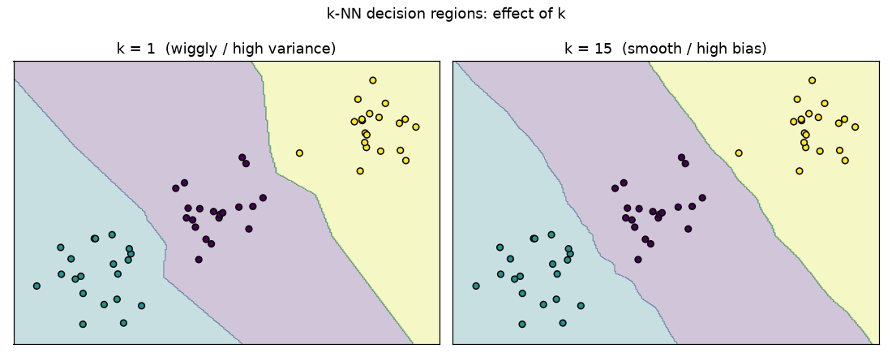
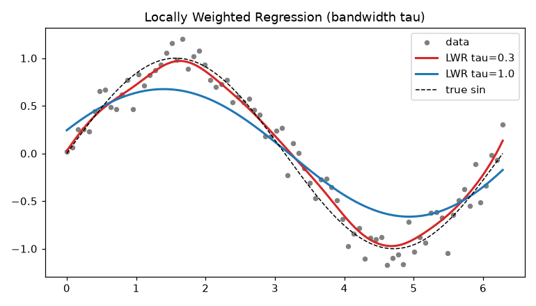

# Module 6 — Instance-Based Learning

### A Beginner's Deep-Dive Study Guide (BITS AIML ZG565 — Contact Session 7)

> **Handout, Session 7:** *k-Nearest Neighbor Learning, Locally Weighted Regression (LWR), Radial Basis Functions* → **T1 (Mitchell) Ch.8**.
> Built from the handout topic list + Mitchell Ch.8 + the course "Instance Based Learning" slides, in the same format as your Module 1–5 guides.

---

## How to use this guide
Same recipe: **plain idea → definition → mental map → worked example → runnable Python.**
Diagrams: `images/`. Runnable, verified code: `Module6_examples.py`.
This is a change of philosophy from Modules 3–5. Those were **eager** learners (build one global model at training time). Instance-based methods are **lazy**: they **store the data** and only compute an answer **when a query arrives**, using the *nearby* examples.

> 🧠 **The whole module in one line:** *Don't build a global model — just **remember all examples**, and when a new point arrives, **answer using its neighbours** (vote for kNN, weighted local fit for LWR, weighted kernels for RBF).*

---

## 🗺️ Bird's-eye Mental Map (start here)

```
                    INSTANCE-BASED / "LAZY" LEARNING (Module 6)
                                     │
   store all training data; generalise only at query time (curse of dimensionality!)
                                     │
      ┌──────────────────────┬───────┴───────────┬────────────────────────┐
      ▼                      ▼                    ▼                        ▼
   k-NN                Distance-Weighted     Locally Weighted        Radial Basis
   vote/average        k-NN                  Regression (LWR)        Functions (RBF)
   of k nearest        weight ∝ 1/d²         fit a little local      EAGER: k Gaussian
   Euclidean dist      (closer = louder)     linear model per query  kernels + linear
   1-NN = Voronoi                                                     output layer
```
Left→right = "how local / how smooth". kNN = crude vote; LWR = local regression; RBF = a network of local Gaussian bumps.

---

## Table of Contents
1. [What is Instance-Based Learning? (Simple Explanation)](#1-what)
2. [Distance metrics — the heart of "similar"](#2-distance)
3. [k-Nearest Neighbours (classification & regression)](#3-knn)
4. [Distance-Weighted k-NN](#4-weighted)
5. [Locally Weighted Regression (LWR)](#5-lwr)
6. [Radial Basis Function (RBF) networks](#6-rbf)
7. [Curse of dimensionality & practical issues](#7-issues)
8. [Python Implementation](#8-python)
9. [Worked Examples](#9-worked)
10. [Scenario-Based Questions](#10-scenarios)
11. [Practice Problems](#11-practice)
12. [Key Takeaways · Common Mistakes · Connections · Quick Reference · Glossary + Self-check](#12-wrap)

---

<a name="1-what"></a>
## 1. What is Instance-Based Learning? (Simple Explanation)

**Instance-based** (a.k.a. memory-based, lazy) learning **stores the training examples** and postpones all generalisation until a **query** must be answered. To answer, it looks at the **most similar stored examples** and combines their labels.

**Real-world analogy — asking your neighbours.** New in town and want to know if a restaurant is good? You ask the **5 people who live nearest** and go with the majority. You didn't build a city-wide theory of restaurants; you used **local, similar** evidence on demand. That is exactly k-NN.

**Eager vs Lazy (a key exam contrast):**
| | Eager (Modules 3–5, RBF) | **Lazy (kNN, LWR, CBR)** |
|---|---|---|
| Training | build one global model | **just store data** |
| Query time | fast (plug into model) | **slow (search neighbours)** |
| Hypothesis | one global function | **many implicit local functions** |
| Uses the query x? | no (committed already) | **yes — fits around x** |

**Why it matters:** lazy methods can fit very complex boundaries with **zero training cost** and adapt locally to each query — but they pay at prediction time and suffer badly from irrelevant features (**curse of dimensionality**).

---

<a name="2-distance"></a>
## 2. Distance metrics — the heart of "similar"

Everything hinges on how we measure "close". For instances `x = (x₁,…,x_d)`:

**Euclidean (straight-line, the default):**
$$d(x_i, x_j) = \sqrt{\sum_{r=1}^{d} (x_{i,r} - x_{j,r})^2}$$

**Manhattan (city-block):** $d = \sum_r |x_{i,r}-x_{j,r}|$. **Minkowski (general):** $d = (\sum_r |x_{i,r}-x_{j,r}|^p)^{1/p}$ (p=2 Euclidean, p=1 Manhattan).

**⚠️ Always scale features first.** Distance is dominated by large-range features. Income (0–100000) would swamp age (0–100) unless you standardise (`z = (x−μ)/σ`) or min-max scale. (This ties back to Module 2 preprocessing.)

**✍️ Worked:** `a=[1,2]`, `b=[4,6]` → `d = √((4−1)² + (6−2)²) = √(9+16) = √25 = 5`.

---

<a name="3-knn"></a>
## 3. k-Nearest Neighbours

**Algorithm (query `x_q`):**
```
1. Compute distance from x_q to every stored example.
2. Pick the k nearest.
3. Classification: predict the MAJORITY class among them.
   Regression:     predict the MEAN of their target values.
```

**Formally (Mitchell):**
- Classification: $\hat f(x_q) = \arg\max_{v}\sum_{i=1}^{k} \delta(v, f(x_i))$ where δ=1 if labels match.
- Regression: $\hat f(x_q) = \frac{1}{k}\sum_{i=1}^{k} f(x_i)$.

**Choosing k (bias–variance again):**
- **k=1:** zero training error, very **wiggly** boundary (**high variance**), sensitive to noise. The decision surface is a **Voronoi diagram** — convex polygons, one per training point.
- **Large k:** smoother boundary (**high bias**), but can wash out real structure; if k = N you always predict the global majority.
- Rule of thumb: try odd k (avoids ties in binary), tune by cross-validation; a common start is `k ≈ √N`.



**Nice theory fact:** as training size → ∞, the **1-NN error is at most twice the Bayes (optimal) error rate** — surprisingly good for such a simple rule.

**✍️ Worked (k=3 classification).** Query `x_q=(2,2)`. Neighbours & labels:
```
A(1,1)=+  d=√2≈1.41
B(2,3)=+  d=1.00
C(3,3)=−  d=√2≈1.41
D(5,5)=−  d=√18≈4.24
3 nearest = {B(+), A(+), C(−)}  → votes: + , + , −  → predict +
```

---

<a name="4-weighted"></a>
## 4. Distance-Weighted k-NN

Plain k-NN treats the 1st and kth neighbour equally. **Weight closer neighbours more** using a kernel of distance — typically the **inverse square**:
$$w_i = \frac{1}{d(x_q, x_i)^2}$$

**Weighted prediction:**
- Classification: $\hat f(x_q) = \arg\max_v \sum_i w_i\,\delta(v, f(x_i))$ (weighted vote).
- Regression: $\hat f(x_q) = \dfrac{\sum_i w_i\, f(x_i)}{\sum_i w_i}$ (weighted average; the denominator **normalises**).

- If `x_q` exactly equals some `x_i` (distance 0 → weight ∞), just return that example's label (majority if several).
- Because far points contribute ≈0, you can safely use **all** training points (a **global** method) — distant ones simply don't matter.

**✍️ Worked (weighted regression).** Neighbours with target values:
```
N1: value 10, d=1  → w=1/1²   = 1.00
N2: value 20, d=2  → w=1/2²   = 0.25
N3: value 30, d=5  → w=1/25   = 0.04
ŷ = (1·10 + 0.25·20 + 0.04·30)/(1+0.25+0.04)
  = (10 + 5 + 1.2)/1.29 = 16.2/1.29 = 12.56   (pulled toward the closest, N1)
```

---

<a name="5-lwr"></a>
## 5. Locally Weighted Regression (LWR)

kNN predicts a **single value** at `x_q`. **LWR** goes further: it **fits an explicit function** (usually a line) to the neighbourhood, weighting each example by its distance, then evaluates that local fit at `x_q`.

- **Local:** only nearby data matter. **Weighted:** each contributes by a kernel `K(d(x_q, x))`. **Regression:** we fit a real-valued function (e.g. linear `f̂(x)=w·x`).

**Weighting kernel (Gaussian):** $K(d) = e^{-d^2/(2\tau^2)}$ where the **bandwidth τ** controls how "local" the fit is (small τ = very local & wiggly; large τ → ordinary global regression).

**Local cost minimised for each query** (weighted least squares):
$$J(w) = \sum_{i} K\big(d(x_q,x_i)\big)\,\big(f(x_i) - w\cdot x_i\big)^2$$
Solve with the weighted normal equation $w = (X^\top W X)^{-1} X^\top W y$ (W = diag of kernel weights), or by a distance-penalised gradient-descent rule:
$$\Delta w_j = \eta \sum_{i} K(d(x_q,x_i))\,\big(f(x_i)-\hat f(x_i)\big)\,x_{i,j}$$

**Key point:** a **new local model is built per query** — that's why LWR is lazy and flexible. It can trace a curvy target with a set of simple local lines.



---

<a name="6-rbf"></a>
## 6. Radial Basis Function (RBF) networks

RBF is the **eager cousin** of distance-weighted methods: instead of waiting for a query, it **pre-builds** a global function as a **sum of local Gaussian bumps**.

**A function is "radial"** if its value depends only on the distance from a centre `c`: `φ(x) = φ(‖x − c‖)`. The **Gaussian RBF** is the workhorse:
$$\phi(x) = \exp\!\Big(-\frac{\|x-c\|^2}{2\sigma^2}\Big) = \exp\big(-\gamma\|x-c\|^2\big)$$
It's ≈1 when `x` is near the centre and decays smoothly to 0 far away (a **local receptive field**).

**Network output (3-layer feedforward):** input → hidden RBF units → linear output:
$$f(x) = w_0 + \sum_{u=1}^{K} w_u\, \phi_u(\|x - c_u\|)$$

**Two-stage hybrid training** (this is what makes RBF fast):
1. **Unsupervised:** choose the **K centres** `c_u` (often by **k-means** on the inputs) and set widths `σ_u` from inter-cluster spacing.
2. **Supervised:** freeze centres/widths, build the design matrix `Φ` (`Φ_{n,u}=φ_u(x_n)`), and solve the **linear** output weights in closed form:
$$w = (\Phi^\top \Phi)^{-1}\Phi^\top y \quad\text{(least squares / pseudoinverse)}.$$

**Why RBF is powerful:** projecting inputs into a high-dimensional space of local bumps often makes a problem **linearly separable** — the same idea behind the **SVM Gaussian kernel** (Module 7), where each support vector acts as a centre.

| | RBF network (eager) | Distance-weighted k-NN / LWR (lazy) |
|---|---|---|
| When built | before queries, around centres/clusters | at query time, around `x_q` |
| Speed | fast at predict, closed-form fit | slow at predict |
| Targeted to query? | no | yes |

---

<a name="7-issues"></a>
## 7. Curse of dimensionality & practical issues

- **Curse of dimensionality:** k-NN uses **all** attributes. If the label depends on only a few, the many irrelevant ones make truly similar points look far apart — "nearest" becomes meaningless in high dimensions. *Fixes:* feature selection, **feature weighting** (stretch/shrink axes), or dropping irrelevant attributes (weight 0). Tune weights via **leave-one-out cross-validation** (cheap for k-NN — no retraining).
- **Prediction cost:** every query scans all data. *Fix:* index with a **kd-tree** / ball-tree so neighbours are found in ≈`O(log N)`.
- **Scaling is mandatory** (see §2). **Ties:** use odd k; break ties by nearest or by prior.
- **Case-Based Reasoning (CBR):** the same "lazy, retrieve-similar" idea for **symbolic** instances where Euclidean distance doesn't apply (e.g. CADET reasons over design *graphs* using largest-shared-subgraph similarity, then adapts/combines retrieved cases with domain knowledge).

---

<a name="8-python"></a>
## 8. Python Implementation

**(a) k-NN from scratch:**
```python
import numpy as np
def knn_predict(X_train, y_train, x_q, k=3, task="clf"):
    d = np.sqrt(((X_train - x_q) ** 2).sum(axis=1))   # Euclidean to every point
    idx = np.argsort(d)[:k]                            # k nearest indices
    if task == "clf":
        vals, counts = np.unique(y_train[idx], return_counts=True)
        return vals[counts.argmax()]                  # majority vote
    return y_train[idx].mean()                         # regression: mean
```

**(b) Distance-weighted regression:**
```python
def weighted_knn_reg(X_train, y_train, x_q, k=3, eps=1e-12):
    d = np.sqrt(((X_train - x_q) ** 2).sum(axis=1))
    idx = np.argsort(d)[:k]
    w = 1.0 / (d[idx] ** 2 + eps)                      # inverse-square weights
    return (w * y_train[idx]).sum() / w.sum()
```

**(c) scikit-learn (kNN + RBF network via kernel):**
```python
from sklearn.neighbors import KNeighborsClassifier
KNeighborsClassifier(n_neighbors=5, weights="distance").fit(X, y)   # weighted kNN
# An RBF layer = Gaussian kernel features, then a linear model:
from sklearn.pipeline import make_pipeline
from sklearn.kernel_approximation import RBFSampler
from sklearn.linear_model import Ridge
make_pipeline(RBFSampler(gamma=0.5, n_components=50, random_state=0), Ridge())
```

---

<a name="9-worked"></a>
## 9. Worked Examples

**Example 1 — Euclidean distance & 1-NN.** Train: `A(1,1)=+`, `B(4,5)=−`. Query `x_q=(2,2)`.
```
d(A) = √((2−1)²+(2−1)²) = √2 ≈ 1.41
d(B) = √((2−4)²+(2−5)²) = √(4+9) = √13 ≈ 3.61
1-NN → A → predict +
```

**Example 2 — k=3 vs k=1 disagree (why k matters).** Points:
`P1(0,0)=+, P2(0,1)=−, P3(1,0)=−, P4(3,3)=+`; query `(0.4,0.4)`.
```
d(P1)=0.566(+), d(P2)=0.721(−), d(P3)=0.721(−), d(P4)=3.68(+)
1-NN = P1 → +.   3-NN = {P1(+),P2(−),P3(−)} → majority − .
Lesson: k changes the answer; tune it by cross-validation.
```

**Example 3 — Distance-weighted regression.** k=3 neighbours, targets & distances:
```
(v=10,d=1), (v=20,d=2), (v=30,d=5)
w = [1, 0.25, 0.04];  ŷ = (10 + 5 + 1.2)/1.29 = 12.56  (closest dominates)
```

**Example 4 — Gaussian RBF activation.** Centre `c=(2,2)`, σ=1, point `x=(3,2)`.
```
‖x−c‖² = (3−2)²+(2−2)² = 1
φ(x) = exp(−1/(2·1²)) = exp(−0.5) = 0.607     (fairly active, x is close)
For x=(5,2): ‖x−c‖²=9 → φ=exp(−4.5)=0.011     (nearly silent, far away)
```

---

<a name="10-scenarios"></a>
## 10. Scenario-Based Questions

**Scenario 1 — Real-time recommender with daily new items.**
*Q:* Your catalogue changes hourly; retraining a big model each time is costly. Approach?
*Solution:* Use **k-NN (lazy)** — just add new items to the store; no retraining. Serve "similar items" by nearest neighbours (index with a kd-/ball-tree for speed).
*Why:* Lazy learning has ~zero training cost and adapts instantly to new data.

**Scenario 2 — k-NN accuracy collapses with 200 features.**
*Q:* Adding many features made k-NN worse. Why, and what do you do?
*Solution:* **Curse of dimensionality** — irrelevant features dominate distance. Do feature selection / weighting (LOO-CV to set weights), or reduce dimensions (PCA).
*Why:* Distance-based methods need *relevant, scaled* features to keep "nearest" meaningful.

**Scenario 3 — Smoothly varying sensor curve.**
*Q:* You must predict a smooth non-linear sensor response and want a local fit that follows the curve.
*Solution:* **Locally Weighted Regression** with a Gaussian kernel; tune bandwidth τ (small=wiggly, large=smooth). Or an **RBF network** if you need fast repeated predictions.
*Why:* Local weighted fits capture curvature that a single global line misses.

---

<a name="11-practice"></a>
## 11. Practice Problems

**Problem 1.** Compute Euclidean distance between `(2,−1,3)` and `(4,0,3)`.
*Solution:* `√((4−2)²+(0+1)²+(3−3)²)=√(4+1+0)=√5≈2.236`. *Tests:* distance metric.

**Problem 2.** Train `A(1)=+ , B(2)=+ , C(6)=− , D(7)=−` (1-D). Query x=4, k=3. Predict.
*Solution:* distances: A=3,B=2,C=2,D=3 → 3 nearest = {B(+),C(−)} tie at 2 plus one of A/D at 3. Nearest three by distance = B(2,+),C(2,−),A(3,+) → majority **+**. *Tests:* k-NN voting & ties.

**Problem 3.** Weighted-average regression: neighbours `(v=4,d=1),(v=10,d=2)` with `w=1/d²`. Predict.
*Solution:* `w=[1,0.25]`, `ŷ=(1·4+0.25·10)/1.25=(4+2.5)/1.25=5.2`. *Tests:* distance-weighted regression.

**Problem 4.** Gaussian RBF, centre 0, σ=2. Activation at x=2 and x=4.
*Solution:* `φ(2)=exp(−4/(2·4))=exp(−0.5)=0.607`; `φ(4)=exp(−16/8)=exp(−2)=0.135`. *Tests:* RBF kernel.

**Problem 5.** Why must you standardise features before k-NN? Give a 1-line reason and the formula.
*Solution:* Large-range features dominate Euclidean distance; standardise with `z=(x−μ)/σ` so each feature contributes comparably. *Tests:* preprocessing.

**Problem 6.** State one advantage and one disadvantage of k=1 vs large k.
*Solution:* k=1: fits fine detail (low bias) but high variance/noise-sensitive; large k: smooth/robust (low variance) but high bias, can blur real boundaries. *Tests:* bias–variance for k-NN.

---

<a name="12-wrap"></a>
## 12. Wrap-up

### ✅ Key Takeaways
- Instance-based = **lazy**: store data, generalise **at query time** using **neighbours**.
- **k-NN:** majority vote (classification) / mean (regression) of the k nearest; **k trades bias↔variance**; 1-NN surface = **Voronoi**.
- **Distance-weighted k-NN:** weight ∝ `1/d²` — closer neighbours count more; safe to use all points.
- **LWR:** fit a **weighted local (linear) model per query** — flexible for smooth non-linear targets.
- **RBF networks:** **eager** sum of **Gaussian bumps**; hybrid training (k-means centres + closed-form linear weights); bridge to SVM kernels.
- Beware the **curse of dimensionality**; always **scale** features and consider **kd-tree** indexing.

### ⚠️ Common Mistakes
- **Not scaling features** → one feature dominates distance.
- **Even k in binary** → voting ties. Use **odd k**.
- **Ignoring irrelevant features** → curse of dimensionality wrecks accuracy.
- **Confusing RBF (eager) with LWR (lazy)** → RBF commits before seeing the query; LWR fits around it.
- **Forgetting to normalise** in distance-weighted regression (divide by `Σw`).

### 🔗 Connections
- **Module 2:** distance/scaling, bias–variance.
- **Module 3:** LWR = locally weighted version of linear regression's normal equation/gradient descent.
- **Module 7 (SVM):** the Gaussian/RBF **kernel** reuses this exact bump idea; support vectors ≈ RBF centres.
- **Module 10 (Clustering):** k-means is used to place RBF centres.

### ⚡ Quick Reference
```
Euclidean:      d = √Σ(x_ir − x_jr)²
k-NN clf:       majority vote of k nearest
k-NN reg:       mean of k nearest
Weighted k-NN:  w_i = 1/d_i² ;  ŷ = Σ w_i y_i / Σ w_i
LWR:            minimise Σ K(d(x_q,x_i))·(y_i − w·x_i)²  (per query)
Gaussian RBF:   φ(x) = exp(−‖x−c‖²/(2σ²)) = exp(−γ‖x−c‖²)
RBF output:     f(x) = w0 + Σ_u w_u φ_u(x) ;  w = (ΦᵀΦ)⁻¹Φᵀy
sklearn:        KNeighborsClassifier(n_neighbors=k, weights="distance")
```

### 📖 Glossary
- **Lazy / eager learning:** defer to query time / commit at training time.
- **k-NN:** predict from the k nearest stored examples.
- **Voronoi diagram:** 1-NN decision regions (one cell per training point).
- **Distance-weighted k-NN:** neighbours weighted by `1/d²`.
- **Kernel function K(d):** turns distance into a weight.
- **LWR:** per-query weighted local regression fit.
- **Bandwidth τ / width σ:** how local the kernel is.
- **RBF network:** hidden Gaussian units + linear output; eager.
- **Curse of dimensionality:** irrelevant/too-many features make distances meaningless.
- **kd-tree:** index for fast neighbour search.
- **CBR:** case-based reasoning — lazy learning for symbolic instances.

### 🧪 Self-check (try, then peek)
1. **Q:** Is k-NN eager or lazy? **A:** Lazy — stores data, works at query time.
2. **Q:** k-NN regression prediction rule? **A:** Mean (or weighted mean) of the k nearest targets.
3. **Q:** What shape is the 1-NN decision surface? **A:** A Voronoi diagram (convex polygons).
4. **Q:** Weighted k-NN weight for distance d? **A:** `1/d²` (closer = larger).
5. **Q:** In LWR, how many models are built? **A:** One local model **per query**.
6. **Q:** RBF activation at the centre? **A:** ≈1 (max), decaying to 0 with distance.
7. **Q:** How are RBF centres commonly chosen? **A:** k-means clustering of the inputs.
8. **Q:** Why does k-NN fail in high dimensions? **A:** Curse of dimensionality — irrelevant features swamp the distance.
9. **Q:** 1-NN error bound as N→∞? **A:** ≤ 2× the Bayes error rate.

### 📚 Further Reading
- **T1 Mitchell, Ch.8** (Instance-Based Learning) — primary.
- **R1 Bishop, Ch.6.3** (radial basis functions / kernels).
- **R2 Tan et al., Ch.5** (nearest-neighbour classifiers).

*Next up: Module 7 — Support Vector Machines (maximum margin, kernels, the Mercer trick).*
