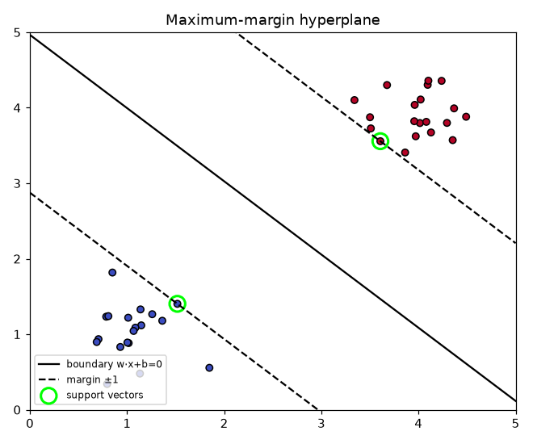
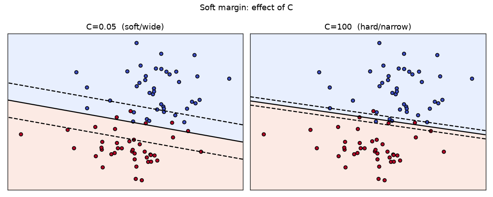
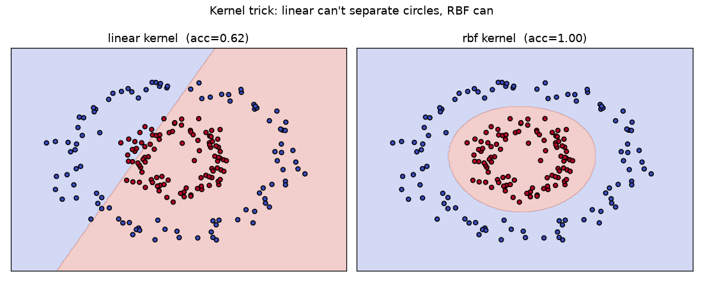

# Module 7 — Support Vector Machines (SVM)

### A Beginner's Deep-Dive Study Guide (BITS AIML ZG565 — Contact Session 9)

> **Handout, Session 9:** *Linearly separable data, Non-linearly separable data, Kernel Trick (Mercer), Applications to both structured and unstructured data* → **R2 (Tan) Ch.4, Burges SVM tutorial**.
> Built from the handout topic list + Burges' tutorial + standard course material, in the same format as your Module 1–6 guides.

---

## How to use this guide
Same recipe: **plain idea → definition → mental map → worked example → runnable Python.**
Diagrams: `images/`. Runnable, verified code: `Module7_examples.py`.
Builds on **Module 4** (linear classifiers, the hyperplane `w·x+b`) and **Module 6** (the RBF/Gaussian kernel idea). SVM asks a sharper question than logistic regression: *of all the separating lines, which is **best**?*

> 🧠 **The whole module in one line:** *Find the separating hyperplane with the **widest margin** (the safest gap), let a few **support vectors** define it, allow a few mistakes with **slack (soft margin)**, and handle curves by the **kernel trick** — computing high-dimensional similarities without ever leaving low dimensions.*

---

## 🗺️ Bird's-eye Mental Map (start here)

```
                    SUPPORT VECTOR MACHINES (Module 7)
                                   │
     goal: MAXIMUM-MARGIN separating hyperplane  w·x + b = 0
                                   │
   ┌───────────────┬──────────────┴───────────┬────────────────────┐
   ▼               ▼                          ▼                    ▼
 Hard margin   Soft margin (C)          Kernel trick (Mercer)   Applications
 separable     allow slack ξ            non-linear via          text (linear),
 max 2/||w||   C = mistake penalty      K(xi,xj)=φ(xi)·φ(xj)    images, bio,
 support       big C=hard,              linear/poly/RBF         structured &
 vectors       small C=soft             no explicit φ needed    unstructured
```
Only the **support vectors** (points on/inside the margin) matter — move any other point and the boundary doesn't change.

---

## Table of Contents
1. [What is an SVM? (Simple Explanation)](#1-what)
2. [The maximum-margin idea & geometry](#2-margin)
3. [The Math: the optimisation problem (with derivation)](#3-math)
4. [The dual form & support vectors](#4-dual)
5. [Soft margin (non-separable data)](#5-soft)
6. [The Kernel Trick & Mercer's condition](#6-kernel)
7. [Python Implementation](#7-python)
8. [Worked Examples](#8-worked)
9. [Scenario-Based Questions](#9-scenarios)
10. [Practice Problems](#10-practice)
11. [Applications (structured & unstructured)](#11-apps)
12. [Key Takeaways · Common Mistakes · Connections · Quick Reference · Glossary + Self-check](#12-wrap)

---

<a name="1-what"></a>
## 1. What is an SVM? (Simple Explanation)

A **Support Vector Machine** is a classifier that draws the **boundary with the biggest safety gap** between two classes. Many lines can separate the same data; the SVM picks the one that is **as far as possible from the nearest points of both classes**.

**Real-world analogy — the widest road.** Imagine two neighbourhoods (classes) with houses (points). You must build a straight road between them. A wise planner builds the **widest possible road** so cars have maximum clearance on both sides. The houses that touch the road's edges are the **support vectors** — they alone determine where the road goes. Every other house is irrelevant.

**Why we need it in ML.**
- **Maximum margin ⇒ good generalisation:** a wide gap is robust to noise and new points; it has strong theoretical (VC-dimension) backing.
- **Sparse:** the model depends only on a few **support vectors**, not all data.
- **Kernels:** with the kernel trick, the same linear machinery draws **curved** boundaries — SVMs were the top general classifier before deep learning, and remain excellent for **small/medium, high-dimensional** data (e.g. text).

---

<a name="2-margin"></a>
## 2. The maximum-margin idea & geometry

The decision boundary is a hyperplane `w·x + b = 0`. We predict `sign(w·x + b)`. For labels `y ∈ {−1, +1}` we require every point to be on the correct side with room to spare:
```
   w·x_i + b ≥ +1   for  y_i = +1
   w·x_i + b ≤ −1   for  y_i = −1
   ⇔  y_i (w·x_i + b) ≥ 1     (combined constraint)
```
The two dashed lines `w·x+b = ±1` are the **margin boundaries**. The perpendicular distance between them — the **margin** — is:
$$\text{margin} = \frac{2}{\|w\|}$$



**Support vectors** are the points that sit exactly on `w·x+b = ±1` (the active constraints). **Maximising the margin `2/‖w‖`** is the same as **minimising `‖w‖²/2`** — a clean convex problem.

---

<a name="3-math"></a>
## 3. The Math: the optimisation problem

### 3.1 Primal (hard-margin) problem
$$\min_{w,b}\ \frac{1}{2}\|w\|^2 \quad\text{subject to}\quad y_i(w\cdot x_i + b) \ge 1,\ \ i=1,\dots,n.$$

**What it says:** find the smallest-norm `w` (⇒ widest margin) that still classifies **every** point correctly with margin ≥ 1.

### 3.2 Why margin = 2/‖w‖ (derivation)
Take a point `x₊` on the `+1` plane and `x₋` on the `−1` plane along the normal `w`. Then `w·x₊ + b = 1` and `w·x₋ + b = −1`. Subtract:
$$w\cdot(x_+ - x_-) = 2 \;\Rightarrow\; \|w\|\,\underbrace{\|x_+ - x_-\|_{\perp}}_{\text{margin}} = 2 \;\Rightarrow\; \text{margin} = \frac{2}{\|w\|}.$$
So a **smaller ‖w‖ ⇒ larger margin**. Minimise `½‖w‖²` (the square keeps it differentiable and convex).

### 3.3 Lagrangian → dual (sketch)
Attach multipliers `α_i ≥ 0` to each constraint:
$$L(w,b,\alpha) = \tfrac12\|w\|^2 - \sum_i \alpha_i\big[y_i(w\cdot x_i + b) - 1\big].$$
Setting `∂L/∂w = 0` and `∂L/∂b = 0` gives the **KKT stationarity** conditions:
$$w = \sum_i \alpha_i y_i x_i, \qquad \sum_i \alpha_i y_i = 0.$$
The first is the punchline: **`w` is a weighted sum of the training points**, and only points with `α_i > 0` (the **support vectors**) contribute.

---

<a name="4-dual"></a>
## 4. The dual form & support vectors

Substituting back gives the **dual** problem (maximise over `α`):
$$\max_{\alpha}\ \sum_i \alpha_i - \tfrac12\sum_i\sum_j \alpha_i\alpha_j\,y_i y_j\,(x_i\cdot x_j) \quad\text{s.t. } \alpha_i\ge 0,\ \sum_i\alpha_i y_i = 0.$$

**Two crucial observations:**
1. The data appear **only as dot products `x_i·x_j`** — this is the doorway to the **kernel trick** (§6).
2. **KKT complementary slackness** `α_i[y_i(w·x_i+b) − 1] = 0` means: for non-support vectors the constraint is slack so `α_i = 0`; only **support vectors** have `α_i > 0`. Hence the model is **sparse**.

**Prediction** uses only support vectors:
$$\hat f(x) = \operatorname{sign}\!\Big(\sum_{i\in SV}\alpha_i y_i\,(x_i\cdot x) + b\Big).$$

---

<a name="5-soft"></a>
## 5. Soft margin (non-separable data)

Real data overlap and have noise — no line separates them perfectly. Introduce **slack variables `ξ_i ≥ 0`** that let points violate the margin, and **penalise** the total violation:
$$\min_{w,b,\xi}\ \tfrac12\|w\|^2 + C\sum_i \xi_i \quad\text{s.t. } y_i(w\cdot x_i+b)\ge 1-\xi_i,\ \ \xi_i\ge 0.$$

**Reading `ξ_i`:** `ξ_i = 0` → correct & outside margin; `0<ξ_i≤1` → inside margin but correct side; `ξ_i>1` → misclassified.

**The `C` hyperparameter (bias–variance knob):**
- **Large C** → mistakes are expensive → narrow, hard margin → risks **overfitting** (low bias, high variance).
- **Small C** → tolerates violations → wide, soft margin → **smoother**, may **underfit** (high bias).



> Equivalent "hinge-loss" view: minimise `½‖w‖² + C Σ max(0, 1 − y_i(w·x_i+b))`. The hinge loss is 0 once a point is safely beyond the margin — that's what makes the solution sparse.

---

<a name="6-kernel"></a>
## 6. The Kernel Trick & Mercer's condition

**The problem:** some data are only separable by a **curve**, not a line.
**The eager idea (Module 6 echo):** map inputs into a **higher-dimensional feature space** `φ(x)` where they *become* linearly separable, then run a linear SVM there. *"A pattern cast non-linearly into a high-dimensional space is more likely to be linearly separable."*

**The trick:** the dual only needs **dot products**. Define a **kernel** that computes the dot product **in feature space directly**, without ever forming `φ`:
$$K(x_i, x_j) = \phi(x_i)\cdot\phi(x_j).$$
Replace every `x_i·x_j` with `K(x_i,x_j)`. You get a non-linear boundary at the cost of a linear one — **without** computing the (possibly infinite-dimensional) `φ`.

**Common kernels:**
| Kernel | `K(x, x′)` | Use |
|---|---|---|
| **Linear** | `x·x′` | text, many features |
| **Polynomial** | `(x·x′ + c)^d` | interaction terms |
| **RBF / Gaussian** | `exp(−γ‖x−x′‖²)` | general non-linear (default) |
| **Sigmoid** | `tanh(κ x·x′ + c)` | neural-net-like |

**Mercer's condition:** a function `K` is a valid kernel (i.e. some feature map `φ` exists) **iff `K` is symmetric and its Gram matrix `K_{ij}=K(x_i,x_j)` is positive semi-definite** for any sample. This is what guarantees the optimisation stays **convex**. The RBF kernel corresponds to an **infinite-dimensional** `φ` — yet costs one exponential to evaluate. (Recall Module 6: RBF-SVM ≈ an RBF network whose centres are the support vectors.)

**✍️ Kernel worked example (why it's "free").** Degree-2 polynomial in 2-D, `x=(x₁,x₂)`, `φ(x)=(x₁², √2 x₁x₂, x₂²)`.
```
Explicit:  φ(a)·φ(b) = a₁²b₁² + 2a₁a₂b₁b₂ + a₂²b₂²
Kernel:    K(a,b) = (a·b)² = (a₁b₁ + a₂b₂)² = a₁²b₁² + 2a₁a₂b₁b₂ + a₂²b₂²   ✓ identical
```
We got the 3-D dot product using only the 2-D one — that is the kernel trick.



---

<a name="7-python"></a>
## 7. Python Implementation

```python
from sklearn.svm import SVC
from sklearn.preprocessing import StandardScaler
from sklearn.pipeline import make_pipeline

# Linear SVM (large-margin linear classifier)
lin = make_pipeline(StandardScaler(), SVC(kernel="linear", C=1.0))

# RBF-kernel SVM for non-linear data (the common default)
rbf = make_pipeline(StandardScaler(), SVC(kernel="rbf", C=1.0, gamma="scale"))
rbf.fit(X, y)
print("support vectors per class:", rbf[-1].n_support_)
```
**Always scale features** (SVMs use distances/dot-products). Tune **`C`** and **`gamma`** together by cross-validation/grid search. `gamma` = 1/(2σ²): large gamma = very local (wiggly, overfits), small gamma = smooth.

---

<a name="8-worked"></a>
## 8. Worked Examples

**Example 1 — Margin from ‖w‖.** Suppose training yields `w=[2,0]`, `b=−4`.
```
boundary: 2x₁ − 4 = 0 → x₁ = 2 (a vertical line).
margin = 2/‖w‖ = 2/2 = 1  → margin planes at x₁ = 1.5 and x₁ = 2.5.
Point (3,0): 2·3−4 = 2 ≥ 1 → class +1, safely outside margin.
```

**Example 2 — Simplest 1-D SVM.** Points `x=−1 (y=−1)` and `x=+1 (y=+1)`.
```
By symmetry boundary is at 0: b=0. Constraints y(wx)=1 at both SVs → w·1=1 → w=1.
margin = 2/‖w‖ = 2. Both points are support vectors (α>0).
Predict x=0.3 → sign(1·0.3)= + .
```

**Example 3 — Polynomial kernel value.** `a=(1,2)`, `b=(3,1)`, `K=(a·b+1)²`.
```
a·b = 1·3 + 2·1 = 5;  K = (5+1)² = 36.
(Equivalently the dot product in the expanded feature space — never computed explicitly.)
```

**Example 4 — RBF kernel value.** `a=(1,2)`, `b=(2,4)`, γ=0.5.
```
‖a−b‖² = (1−2)²+(2−4)² = 1+4 = 5
K = exp(−0.5·5) = exp(−2.5) = 0.082   (fairly dissimilar → small similarity)
```

**Example 5 — Effect of C (reasoning).** Two nearly-overlapping clusters with one outlier.
```
C=1000: SVM bends to classify the outlier → thin margin, likely overfit on test.
C=0.1 : SVM ignores the outlier (pays small penalty) → wide margin, better generalisation.
Choose C by cross-validation.
```

---

<a name="9-scenarios"></a>
## 9. Scenario-Based Questions

**Scenario 1 — Text/spam classification with 50,000 features.**
*Q:* Sparse, very high-dimensional bag-of-words. Which SVM setup?
*Solution:* **Linear-kernel SVM** (`LinearSVC`/`SVC(kernel="linear")`). High-dimensional text is usually already linearly separable; linear kernels are fast and generalise well.
*Why:* RBF adds cost/overfitting risk with no benefit when data are already linearly separable in high-D.

**Scenario 2 — Two interleaving "moons".**
*Q:* Classes form curved, interlocking shapes. Approach?
*Solution:* **RBF-kernel SVM**; grid-search `C` and `gamma`. The kernel maps to a space where a linear separator exists.
*Why:* No straight line separates moons; the kernel trick provides a non-linear boundary cheaply.

**Scenario 3 — A few mislabeled points ruin a hard-margin fit.**
*Q:* Hard-margin SVM contorts to fit noise. Fix?
*Solution:* Use a **soft margin** with a moderate/small **C** so slack absorbs the noisy points; tune C by CV.
*Why:* Soft margin trades a few violations for a wider, more robust boundary — better generalisation.

---

<a name="10-practice"></a>
## 10. Practice Problems

**Problem 1.** `w=[3,4]`. What is the margin width?
*Solution:* `‖w‖=√(9+16)=5`; margin `=2/5=0.4`. *Tests:* margin formula.

**Problem 2.** Point `x=(2,1)`, `w=[1,2]`, `b=−3`, true `y=+1`. Is the margin constraint `y(w·x+b)≥1` satisfied?
*Solution:* `w·x+b=1·2+2·1−3=1`; `y·1=1≥1` ✓ (it lies exactly on the margin — a support vector). *Tests:* margin constraint.

**Problem 3.** Compute the RBF kernel between `(0,0)` and `(1,1)` with γ=1.
*Solution:* `‖·‖²=2`; `K=exp(−1·2)=exp(−2)=0.135`. *Tests:* RBF kernel.

**Problem 4.** For polynomial kernel `K=(a·b+1)^2` with `a=(2,0)`, `b=(0,2)`, find K.
*Solution:* `a·b=0`; `K=(0+1)²=1`. *Tests:* polynomial kernel.

**Problem 5.** You increase `gamma` a lot in an RBF-SVM and training accuracy hits 100% but test drops. What happened and what do you tune?
*Solution:* Large gamma → very local kernels → **overfitting**. Lower gamma and/or C; select both by cross-validation. *Tests:* gamma/overfitting.

**Problem 6.** Why do only support vectors appear in the prediction formula?
*Solution:* KKT complementary slackness forces `α_i=0` for points strictly outside the margin; only `α_i>0` (support vectors) remain in `f(x)=sign(Σ α_i y_i K(x_i,x)+b)`. *Tests:* sparsity/duality.

**Problem 7.** State Mercer's condition in one sentence.
*Solution:* `K` is a valid kernel iff it is symmetric and every Gram matrix `K_{ij}=K(x_i,x_j)` is positive semi-definite (guaranteeing an underlying feature map φ and convexity). *Tests:* kernel validity.

---

<a name="11-apps"></a>
## 11. Applications (structured & unstructured)

- **Unstructured / high-dimensional:** **text** categorisation & spam (linear kernel), **image** classification (histogram/RBF kernels), **handwritten-digit** recognition (a classic SVM win), **bioinformatics** (gene/protein classification).
- **Structured data via custom kernels:** define a valid kernel that measures similarity of **strings, trees, or graphs** (e.g. string kernels for DNA, graph kernels for molecules). Because SVMs only need `K(x_i,x_j)`, any Mercer-valid similarity plugs in — you never need explicit feature vectors.
- **Why SVMs shine here:** strong generalisation from **few samples in high dimensions**, robust maximum-margin objective, and kernel flexibility.

---

<a name="12-wrap"></a>
## 12. Wrap-up

### ✅ Key Takeaways
- SVM finds the **maximum-margin** hyperplane: minimise `½‖w‖²` s.t. `y_i(w·x_i+b)≥1`; margin `= 2/‖w‖`.
- Only **support vectors** (α>0) define the boundary → the model is **sparse**.
- **Soft margin** adds slack `ξ` and penalty **C** to handle noise/overlap (C = bias–variance knob).
- The **dual** uses data only as **dot products** → swap in a **kernel** for non-linear boundaries.
- **Mercer's condition** (symmetric + PSD Gram matrix) says which kernels are valid; **RBF** is the default.
- **Always scale**; tune **C** and **gamma** by cross-validation.

### ⚠️ Common Mistakes
- **Forgetting to scale features** → distance-based kernels misbehave.
- **Huge C or gamma** → overfitting (memorises noise); **too small** → underfitting.
- **Using RBF when linear suffices** (high-D text) → slower, worse.
- **Thinking all points matter** → only support vectors do.
- **Using an invalid kernel** (non-PSD) → non-convex, meaningless solution.

### 🔗 Connections
- **Module 4:** same hyperplane `w·x+b`; SVM adds the *maximum-margin* criterion and hinge loss (vs logistic's log-loss).
- **Module 6:** the RBF/Gaussian kernel = the same local-bump idea; support vectors ≈ RBF centres.
- **Module 3:** `½‖w‖²` is L2 regularisation; soft-margin SVM = hinge loss + L2 penalty.
- **Module 9:** SVMs can be base learners in ensembles.

### ⚡ Quick Reference
```
Decision:     f(x) = sign(w·x + b)
Primal:       min ½‖w‖²  s.t. y_i(w·x_i+b) ≥ 1
Margin:       2/‖w‖
Soft margin:  min ½‖w‖² + C Σ ξ_i ,  y_i(w·x_i+b) ≥ 1 − ξ_i
Dual:         max Σα_i − ½ΣΣ α_iα_j y_iy_j K(x_i,x_j),  α_i≥0, Σα_i y_i=0
w:            w = Σ α_i y_i x_i     (support vectors only)
Kernels:      linear x·x' ; poly (x·x'+c)^d ; RBF exp(−γ‖x−x'‖²)
Mercer:       K symmetric & PSD Gram matrix ⇔ valid kernel
sklearn:      SVC(kernel="rbf", C=…, gamma=…)  after StandardScaler
```

### 📖 Glossary
- **Hyperplane:** `w·x+b=0`, the decision boundary.
- **Margin:** gap `2/‖w‖` between the `±1` planes; SVM maximises it.
- **Support vectors:** points on/inside the margin (α>0) that define the boundary.
- **Hard / soft margin:** no violations / allow slack `ξ` with penalty `C`.
- **Slack `ξ_i`:** how much point i violates its margin.
- **C:** penalty for violations (large=hard/overfit, small=soft/underfit).
- **Dual / α_i:** reformulation using Lagrange multipliers; nonzero only for SVs.
- **Kernel `K(x,x′)`:** dot product in feature space without computing φ.
- **Kernel trick:** replace `x·x′` by `K` to get non-linear boundaries.
- **Mercer's condition:** symmetric + PSD ⇒ valid kernel.
- **gamma (RBF):** kernel width `1/(2σ²)`; large=local/overfit.

### 🧪 Self-check (try, then peek)
1. **Q:** What does an SVM maximise? **A:** The margin (`2/‖w‖`) between classes.
2. **Q:** Which points determine the boundary? **A:** The support vectors (α>0).
3. **Q:** Margin if `‖w‖=4`? **A:** `2/4 = 0.5`.
4. **Q:** What does slack `ξ` allow? **A:** Margin violations / misclassifications (soft margin).
5. **Q:** Large C vs small C? **A:** Large = hard margin (overfit risk); small = soft (underfit risk).
6. **Q:** Why can we use a kernel? **A:** The dual depends only on dot products `x_i·x_j`.
7. **Q:** RBF kernel formula? **A:** `exp(−γ‖x−x′‖²)`.
8. **Q:** When is `K` a valid kernel? **A:** Mercer: symmetric with a PSD Gram matrix.
9. **Q:** Best kernel for high-D sparse text? **A:** Linear.
10. **Q:** Poly kernel `(a·b+1)²` with `a·b=3`? **A:** `(3+1)²=16`.

### 📚 Further Reading
- **Burges (1998)**, *A Tutorial on Support Vector Machines for Pattern Recognition* — primary.
- **R2 Tan, Steinbach & Kumar, Ch.4** (SVM section).
- **R1 Bishop, Ch.7** (sparse kernel machines, SVM & Mercer kernels).

*This completes the pre-midsem sequence (Modules 1–8 topics up to SVM). Next: Module 8 — Bayesian Learning.*
