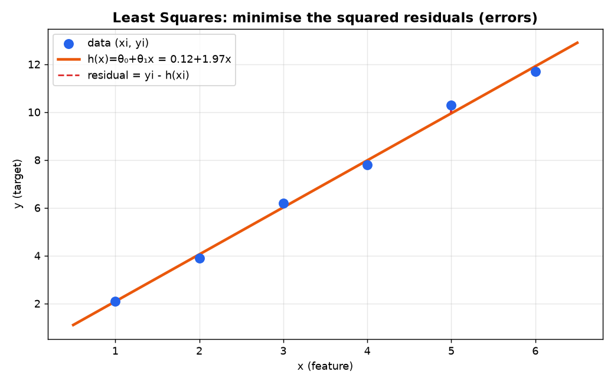
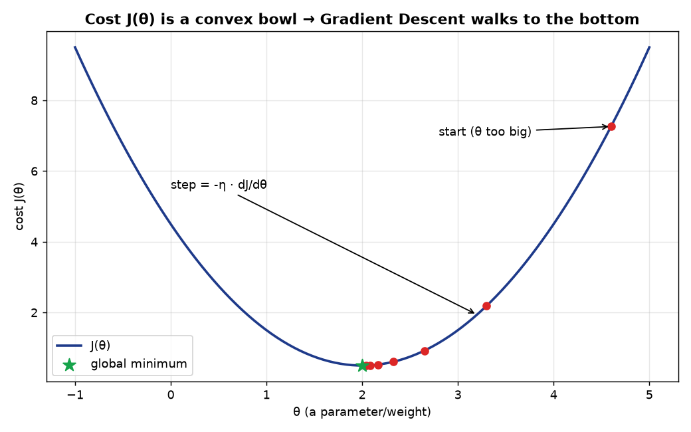
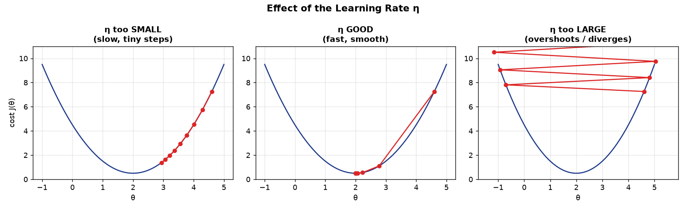
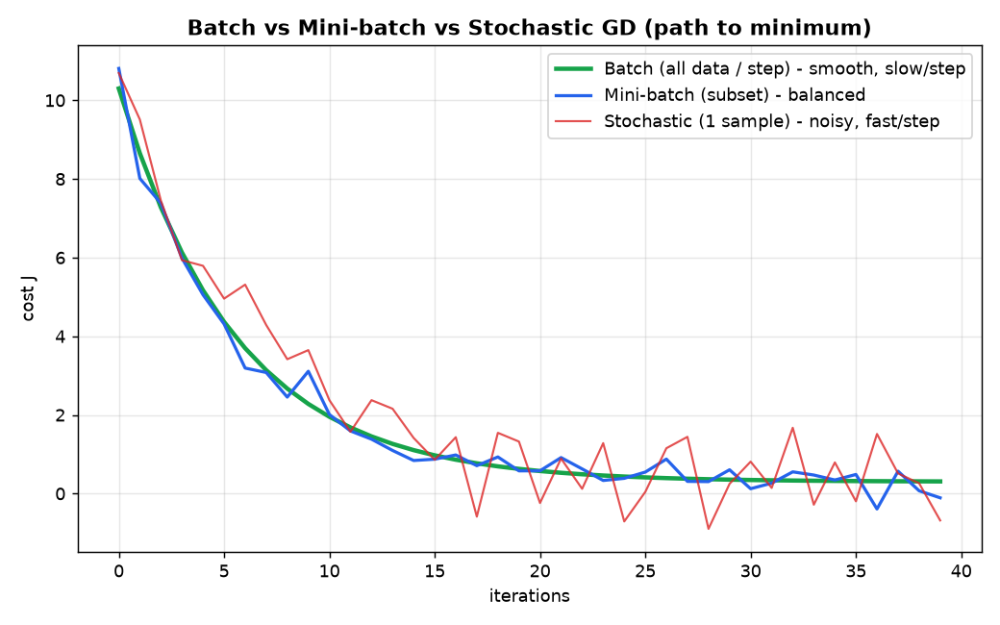
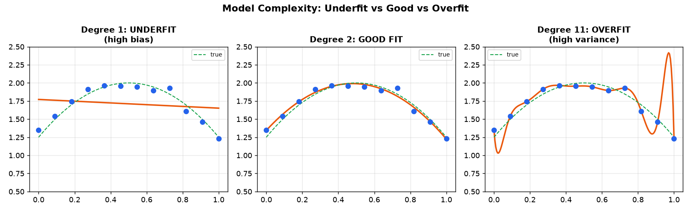
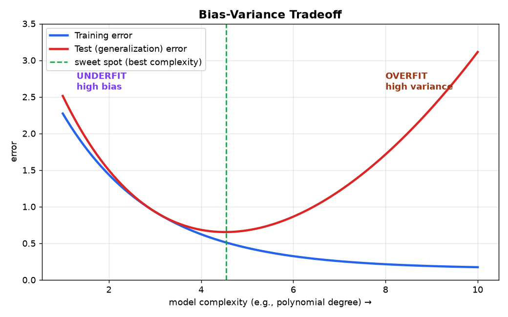
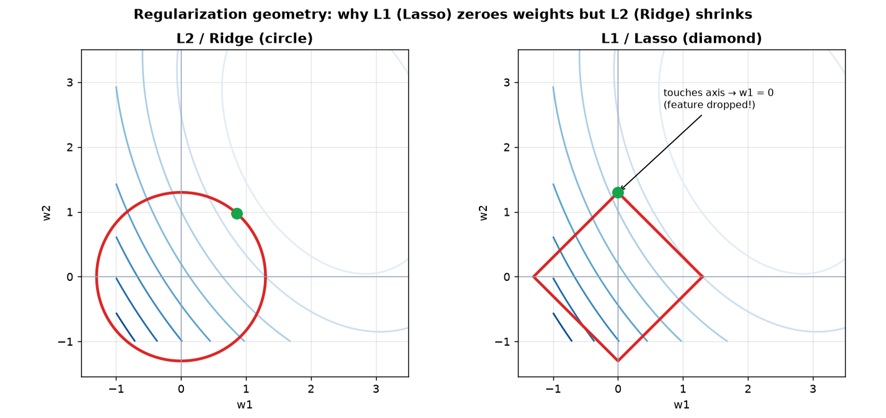

# Module 3 — Linear Models for Regression
### A Beginner's Deep-Dive Study Guide (BITS AIML ZG565 — Module 3 slides + Contact Session 3)

> **Handout, Contact Session 3:** *"Direct Solution Method, Iterative Method — Gradient Descent (batch/stochastic/mini-batch), Linear basis function models, Bias-variance"* → **R1 (Bishop) Ch.3**.
> Builds directly on Module 2's math preliminaries (dot products + gradient descent). Regularization here is shared with Module 4.

---

## How to use this guide
Same recipe: **plain idea → definition → mental map → worked example → runnable Python.**
Diagrams: `module3_images/`. Runnable, verified code: `module3_examples.py`.

> 🧠 **The whole module in one line:** *Fit the best straight line (or curve) through data by choosing weights that make the total squared error as small as possible — either by a formula (closed form) or by walking downhill (gradient descent) — without over-fitting.*

---

## Table of Contents
1. [What is (linear) regression?](#1-what)
2. [The model: hypothesis & parameters](#2-model)
3. [The Cost Function (Least Squares / MSE)](#3-cost)
4. [Solution 1 — Closed Form (Normal Equation)](#4-closed-form)
5. [Solution 2 — Gradient Descent](#5-gradient-descent)
   - 5.1 The update rule & a fully worked iteration
   - 5.2 Learning rate
   - 5.3 Feature scaling
   - 5.4 Batch vs Mini-batch vs Stochastic
   - 5.5 Closed form vs GD — which to use
6. [Evaluating a regression model (MSE, RMSE, R²)](#6-metrics)
7. [Linear Basis Function Models & Polynomial Regression](#7-basis)
8. [Bias–Variance & Overfitting](#8-bias-variance)
9. [Regularization: Ridge, Lasso, Elastic Net](#9-regularization)
10. [Glossary + Self-check](#10-glossary)

---

<a name="1-what"></a>
## 1. What is (linear) regression?

**Supervised learning** where the label **y is a real number** (Module 1). Goal: *given unseen x, predict a value y as accurately as possible.*
Given data `(x₁,y₁), …, (xₙ,yₙ)`, learn a function `f(x)` that predicts `y`.

**Types (from the slides):**
- **Simple linear regression** — one input: Education (x) → Income (y).
- **Multiple linear regression** — many inputs: Education, Soft-skills, Experience, Age (x₁…x₄) → Income (y).

```
   Simple:    y = θ₀ + θ₁·x
   Multiple:  y = θ₀ + θ₁·x₁ + θ₂·x₂ + … + θ_d·x_d
```

---

<a name="2-model"></a>
## 2. The model: hypothesis & parameters

The **hypothesis** `h(x)` is our predicting function. For house prices (slide example, Size → Price):
```
   h(x) = θ₀ + θ₁·x
          │     │
          │     └─ θ₁ = slope  (how much price rises per extra sq-ft)
          └─────── θ₀ = intercept/bias (price when size = 0)
```
- **θ (theta) = parameters/weights** — the numbers the machine learns.
- Different θ's give different lines. **The whole job = "How do we choose the θ's?"**

Notation decoded: `h_θ(x)` just means "the hypothesis h that uses parameters θ, evaluated at input x."

---

<a name="3-cost"></a>
## 3. The Cost Function — Least Squares (MSE)

To pick the best line we need to **measure how wrong a line is.** For each point, the **residual** is the vertical gap between the actual `yᵢ` and the predicted `h(xᵢ)`:



We square each residual (so + and − don't cancel, and big misses hurt more) and average. This is the **Mean Squared Error cost**:
```
            1   n
   J(θ) =  ───  Σ  ( h_θ(xᵢ) − yᵢ )²
           2n  i=1
```
Decoding every symbol:
- `Σ` = sum over all n training points.
- `h_θ(xᵢ) − yᵢ` = the error on point i (predicted − actual).
- squared → punishes large errors; `1/n` → average; the extra `½` is a convenience that makes the derivative cleaner (the 2 cancels).

**"Least Squares" = choose θ that makes J(θ) the smallest.**

### Why this cost is nice: it's CONVEX
Plotted against θ, `J(θ)` is a **bowl** (convex) — one single lowest point, no misleading local dips. A **convex** function = the line joining any two points on its graph lies on or above the graph. This guarantees gradient descent can reach the global minimum.



**✍️ Tiny worked cost:** data `(1,3),(2,5),(3,7)`, try line `h(x)=0+1·x` (θ₀=0, θ₁=1):
```
errors: (1−3, 2−5, 3−7) = (−2, −3, −4)
J = 1/(2·3) · (4 + 9 + 16) = 29/6 = 4.83
```
Try the true line `h(x)=1+2x`: errors (0,0,0) → J = 0. Lower cost = better line. ✔

---

<a name="4-closed-form"></a>
## 4. Solution 1 — Closed Form (the "Direct Method" / Normal Equation)

Sometimes we can jump straight to the best θ with a **single formula** (no iterations). Using vectors/matrices (Module 2 linear algebra):
- Stack all inputs into a matrix **X** (each row = one instance, plus a column of 1's for the intercept), and targets into vector **y**.
- The optimal weights are the **Normal Equation**:
```
   θ = (XᵀX)⁻¹ Xᵀ y
```
Decoded: `Xᵀ` = transpose, `(…)⁻¹` = matrix inverse. This is the exact θ that minimises J — derived by setting the gradient of J to zero.

**Vectorization** = writing the whole computation as matrix operations (fast, no Python loops).

**✍️ Worked (our data `(1,3),(2,5),(3,7)`):**
```
X = [[1,1],[1,2],[1,3]]   (first col = 1's for θ₀)
y = [3,5,7]
θ = (XᵀX)⁻¹ Xᵀ y  =  [1, 2]     → h(x) = 1 + 2x   (perfect fit)
```

**Downside:** `(XᵀX)⁻¹` costs about **O(d³)** for d features — very slow / infeasible when there are **many features** (tens of thousands). That's when we switch to gradient descent.

```python
import numpy as np
X = np.array([[1,1],[1,2],[1,3]]); y = np.array([3,5,7])
theta = np.linalg.inv(X.T @ X) @ X.T @ y
print(theta)   # [1. 2.]
```

---

<a name="5-gradient-descent"></a>
## 5. Solution 2 — Gradient Descent (the "Iterative Method")

**Idea:** start with random θ, then repeatedly step **downhill** on the cost bowl until you reach the bottom. "Downhill" = opposite the gradient (slope).

### 5.1 The update rule
Repeat until convergence, updating **every** parameter simultaneously:
```
   θⱼ ← θⱼ − η · ∂J/∂θⱼ            (η = learning rate)
```
For MSE, the partial derivatives work out to clean forms:
```
   θ₀ ← θ₀ − η · (1/n) Σ ( h(xᵢ) − yᵢ )
   θ₁ ← θ₁ − η · (1/n) Σ ( h(xᵢ) − yᵢ )·xᵢ
```
Read: *"error times (for slopes) the feature, averaged, scaled by η — subtract it."* This is the **LMS rule** from Module 1's checkers design, now made precise.

**Convergence intuition (from slides):**
- If slope is **positive** → we're right of the minimum → subtracting moves θ **left** (down). ✔
- If slope is **negative** → we're left of the minimum → subtracting moves θ **right** (down). ✔
- At the minimum, slope = 0 → θ stops changing. ✔

#### ✍️ Fully worked first iterations (verified in `module3_examples.py`)
Data `(1,3),(2,5),(3,7)`, start `θ₀=0, θ₁=0`, learning rate `η=0.1`, n=3.

**Iteration 1** — predictions `h=0` for all, so errors `= h−y = (−3,−5,−7)`:
```
grad θ₀ = (1/3)(−3−5−7)              = −5.0000
grad θ₁ = (1/3)((−3)(1)+(−5)(2)+(−7)(3)) = (1/3)(−34) = −11.3333
θ₀ ← 0 − 0.1·(−5.0000)      = 0.5000
θ₁ ← 0 − 0.1·(−11.3333)     = 1.1333
```
**Iteration 2** → θ₀=0.7233, θ₁=1.6378.
**Iteration 3** → θ₀=0.8234, θ₁=1.8621.
… continuing, θ marches toward the exact answer **(1, 2)** the normal equation gave. 🎯

> **Note on the slide's RR-CHD exercise** (RR-CHD = 5 − 0.03·BMI − 0.03·Diastolic, η=0.02, one iteration → θ₀=5.0016, θ₁=0.0476, θ₂=0.179): it uses the **exact same update equations** above, just with 3 features and a `1/n = 1/3` factor. Plug the data into
> `θⱼ ← θⱼ − η·(1/n)·Σ(h(x)−y)·xⱼ`.

### 5.2 Choosing the learning rate η
η controls step size — a crucial **hyperparameter**:



| η | Behaviour |
|---|---|
| **too small** | converges very slowly (tiny baby steps) |
| **good** | steady, fast descent to the minimum |
| **too large** | overshoots, oscillates, may **diverge** (cost blows up) |

Practical tip: try η ∈ {0.001, 0.003, 0.01, 0.03, 0.1, 0.3} and watch the cost-vs-iteration curve; it should **decrease smoothly**.

### 5.3 Feature scaling helps GD
If features have very different ranges (size 0–3000 vs bedrooms 0–5), the cost bowl becomes a stretched ellipse and GD zig-zags slowly. **Scaling** features (Module 2 — min-max/standardization) makes the bowl round, so GD goes straight to the bottom → **faster convergence**.

### 5.4 Three flavours of Gradient Descent
The only difference: **how much data you use before each update.**



| Variant | Data per update | Pros | Cons |
|---|---|---|---|
| **Batch** | **all** n examples | stable, smooth path | slow per step on big data |
| **Mini-batch** | a **subset** (e.g. 32) | best of both; GPU-friendly (**most used**) | need to pick batch size |
| **Stochastic (SGD)** | **1** example | very fast updates, escapes shallow dips | noisy, jumps around minimum |

### 5.5 Closed Form vs Gradient Descent
| | Closed Form (Normal Eqn) | Gradient Descent |
|---|---|---|
| How | one formula `(XᵀX)⁻¹Xᵀy` | iterate downhill |
| Learning rate η | not needed | must choose |
| Many features (large d) | **slow** (~O(d³) inverse) | **scales well** |
| Iterations | none | many |
| Best when | few features, exact answer | large data / many features |

---

<a name="6-metrics"></a>
## 6. Evaluating a regression model

On **unseen test data**, measure error:
| Metric | Formula | Meaning |
|---|---|---|
| **MSE** | (1/n)Σ(y−ŷ)² | average squared error (punishes big misses) |
| **RMSE** | √MSE | same units as y (easier to read) |
| **MAE** | (1/n)Σ\|y−ŷ\| | average absolute error |
| **R² (coefficient of determination)** | 1 − SS_res/SS_tot | fraction of variance **explained** by the model |

**R² decoded (slide):**
```
SS_res = Σ(yᵢ − ŷᵢ)²        (variation the model did NOT explain)
SS_tot = Σ(yᵢ − ȳ)²         (total variation around the mean ȳ)
R² = 1 − SS_res/SS_tot
```
- **R² = 1** → perfect fit. **R² = 0** → no better than predicting the mean. Higher = better "goodness of fit."

**✍️ Worked:** actual y=(3,5,7), predicted ŷ=(2.8,5.1,7.1), mean ȳ=5:
```
SS_res = 0.2² + 0.1² + 0.1² = 0.06
SS_tot = (−2)² + 0² + 2²    = 8
R² = 1 − 0.06/8 = 0.9925    → excellent fit
```

---

<a name="7-basis"></a>
## 7. Linear Basis Function Models & Polynomial Regression

**Problem:** what if y is a **curved** (non-linear) function of x? A straight line underfits.

**Trick:** transform the input through **basis functions** `Φⱼ(x)`, then fit a line **in the new features**:
```
   h(x) = w₀·Φ₀(x) + w₁·Φ₁(x) + … + w_{M-1}·Φ_{M-1}(x)
```
- Usually `Φ₀(x)=1` so `w₀` acts as the **bias/intercept**.
- Simplest basis `Φⱼ(x)=x` gives ordinary linear regression.

> 🧠 **Key insight (why they're still "linear" models):** the model is **linear in the weights w**, even if the basis functions of x are curvy. So all the linear-regression machinery (cost, normal equation, GD) still works!

**Polynomial regression** = basis functions are powers of x:
```
   h(x) = w₀ + w₁x + w₂x² + … + w_M x^M
```
Fit it by creating columns `x, x², x³, …` and running linear regression on them.



- Degree too low (1) → **underfit**. Right degree (2) → good. Degree too high (11) → **overfit** (wiggles through every point).

```python
from sklearn.preprocessing import PolynomialFeatures
from sklearn.linear_model import LinearRegression
from sklearn.pipeline import make_pipeline
model = make_pipeline(PolynomialFeatures(degree=2), LinearRegression())
model.fit(X, y)
```

---

<a name="8-bias-variance"></a>
## 8. Bias–Variance & Overfitting

Two ways a model can fail — the central tradeoff of ML:

| | **Bias** (Underfitting) | **Variance** (Overfitting) |
|---|---|---|
| Meaning | model too **simple**, misses the pattern | model too **complex**, memorises noise |
| Train error | high | very low |
| Test error | high | high |
| Example | straight line on a curve | degree-300 polynomial |



*As complexity rises, training error keeps dropping, but test error falls then **rises** — the gap is variance. The best model sits at the **sweet spot** (lowest test error).*

**Three ways to fight overfitting (from slides):**
1. **More training data** — a bigger dataset lets even complex models generalise.
2. **Reduce model complexity** — lower the polynomial degree / fewer features.
3. **Regularization** — penalise large weights (next section).

---

<a name="9-regularization"></a>
## 9. Regularization — keep weights small

**Idea:** add a **penalty on large weights** to the cost, so the model prefers simpler, smoother fits. This trades a little training accuracy for much better generalisation.

```
   J(θ) = MSE  +  λ · (penalty on weight sizes)
                  │
                  └─ λ (lambda) = regularization strength (hyperparameter)
                     λ=0 → no regularization ;  large λ → very simple model
```

### The three regularizers
| Name | Penalty term | Effect | Use when |
|---|---|---|---|
| **Ridge (L2 / Tikhonov)** | `λ Σ wⱼ²` | **shrinks** weights toward 0 (rarely exactly 0) | many small/medium effects |
| **Lasso (L1)** | `λ Σ \|wⱼ\|` | drives some weights **exactly to 0** → **feature selection**, sparse model | few important features |
| **Elastic Net** | mix: `r·L1 + (1−r)·L2` | balance of both | **highly correlated** features |

### Why L1 zeros weights but L2 only shrinks (the famous picture)
The penalty is a "budget region": L2's region is a **circle**, L1's is a **diamond**. The solution is where the cost contours first touch the region. The diamond's **corners lie on the axes**, so the touch point often has a coordinate **= 0** → that weight is dropped.



**Regularized GD update (slide):** the weight-decay factor appears as `(1 − η·λ)`:
```
   Ridge:  wⱼ ← wⱼ·(1 − η·λ) − η·(1/n)Σ(h(x)−y)·xⱼ
```
(θ₀/intercept is usually **not** penalised.)

**Elastic Net mix-ratio r:** `r=0` → pure Ridge; `r=1` → pure Lasso.
```python
from sklearn.linear_model import Ridge, Lasso, ElasticNet
Ridge(alpha=0.1).fit(X, y)              # L2
Lasso(alpha=0.1).fit(X, y)              # L1 (some coefs -> 0)
ElasticNet(alpha=0.1, l1_ratio=0.5)     # 50/50 mix
```

**Practical notes (slides):**
- **L1** → sparse models, does **feature selection**; but not differentiable at 0 (harder for pure gradient methods).
- **L2** → small weights, smooth, gradient-friendly; keeps all features.
- **Elastic Net** → preferred when features are **highly correlated**.

---

<a name="10-glossary"></a>
## 10. Glossary + Self-check

**Glossary**
- **Hypothesis h_θ(x):** the predicting function `θ₀+θ₁x+…`.
- **Parameters/weights θ (or w):** numbers learned from data. **θ₀ = bias/intercept.**
- **Residual:** actual − predicted for one point.
- **Cost function J(θ):** average of squared residuals (MSE); measures how wrong θ is.
- **Least squares:** choosing θ to minimise J.
- **Convex:** bowl-shaped → single global minimum.
- **Normal equation:** closed-form `θ=(XᵀX)⁻¹Xᵀy`.
- **Vectorization:** doing math as matrix ops (fast).
- **Gradient descent:** iterative downhill minimisation `θ←θ−η∇J`.
- **Learning rate η:** step size (too big → diverge, too small → slow).
- **Batch / Mini-batch / Stochastic GD:** all data / a subset / one sample per update.
- **MSE/RMSE/MAE/R²:** regression error metrics; R² = variance explained.
- **Basis function Φ(x):** transform of input; enables curves while staying linear in w.
- **Polynomial regression:** basis = powers of x.
- **Bias/Underfitting vs Variance/Overfitting:** too simple vs too complex.
- **Regularization λ:** penalty on weight size.
- **Ridge (L2) / Lasso (L1) / Elastic Net:** shrink / zero-out / mix.

**Self-check (try, then peek)**
1. **Q:** Why square the residuals in the cost? **A:** So + and − errors don't cancel and large errors are penalised more; also makes J convex & differentiable.
2. **Q:** When prefer gradient descent over the normal equation? **A:** When there are very many features (normal-equation inverse ~O(d³) is too slow).
3. **Q:** η is too large — what happens? **A:** Steps overshoot the minimum; cost oscillates or diverges.
4. **Q:** First GD iteration for data (1,3),(2,5),(3,7), θ=(0,0), η=0.1? **A:** θ₀=0.5, θ₁=1.1333.
5. **Q:** R²=0 means? **A:** Model is no better than always predicting the mean.
6. **Q:** A degree-15 polynomial fits training points perfectly but tests poorly — diagnosis & 2 fixes? **A:** Overfitting (high variance); fix with more data, lower degree, or regularization.
7. **Q:** Which regularizer performs feature selection? **A:** Lasso (L1) — sets some weights exactly to 0.
8. **Q:** Why are polynomial/basis models still called "linear"? **A:** They're linear **in the weights w**, even though Φ(x) is non-linear in x.

### ✅ 30-second recap
- Model: `h(x)=θ₀+θ₁x(+…)`. Fit by minimising **MSE cost J(θ)** (convex bowl).
- Two solvers: **closed-form normal equation** (few features) or **gradient descent** `θ←θ−η∇J` (many features).
- GD flavours: **batch / mini-batch / stochastic**; tune **η**; **scale features** for speed.
- Evaluate with **RMSE / R²** on a **test set**.
- Curves? Use **polynomial / basis functions** (still linear in w).
- Balance **bias vs variance**; fight overfitting with more data, simpler models, or **regularization** (Ridge L2, Lasso L1, Elastic Net).

*Next up: Module 4 — Linear Models for Classification (Logistic Regression, log-loss, decision theory).*
