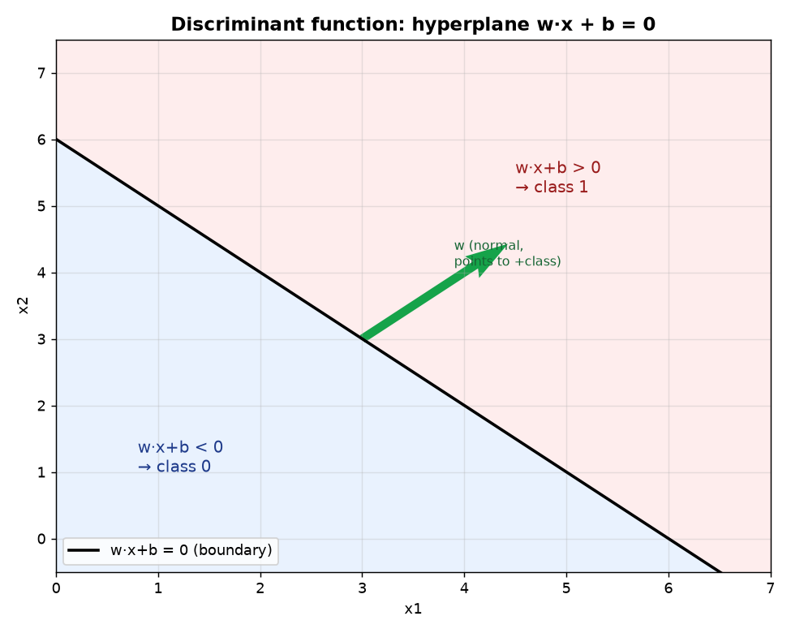
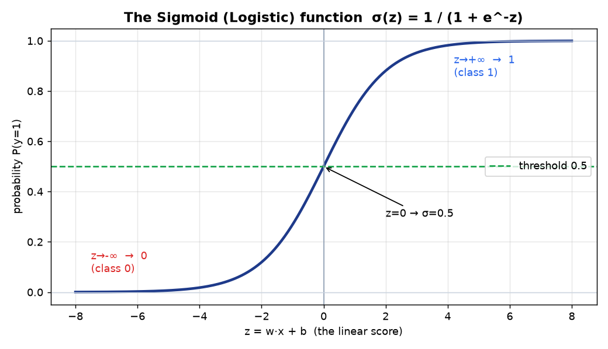
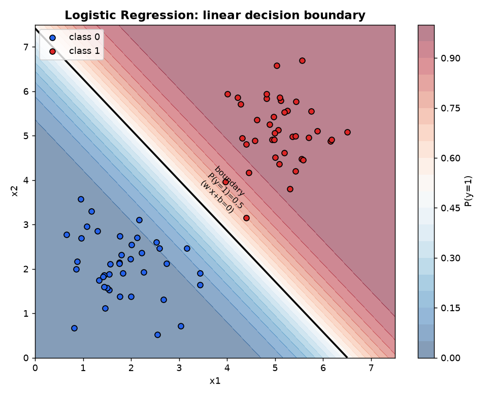
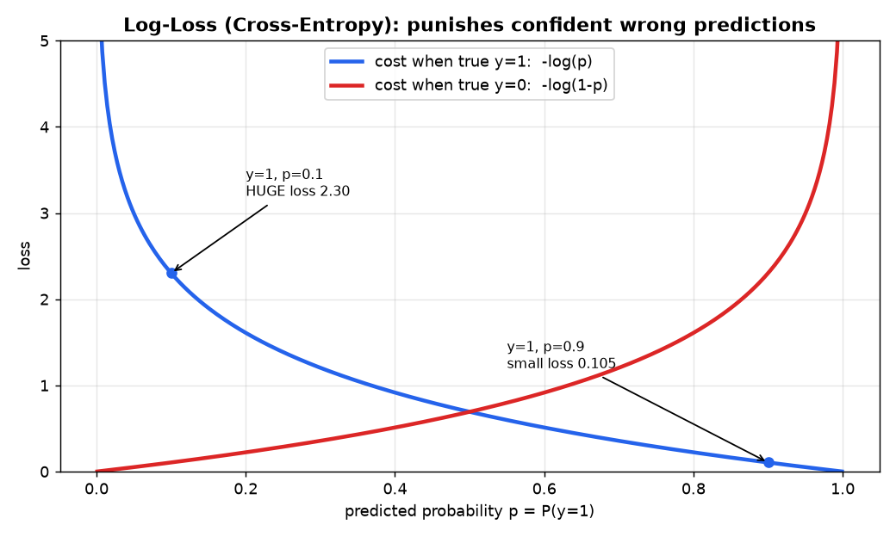
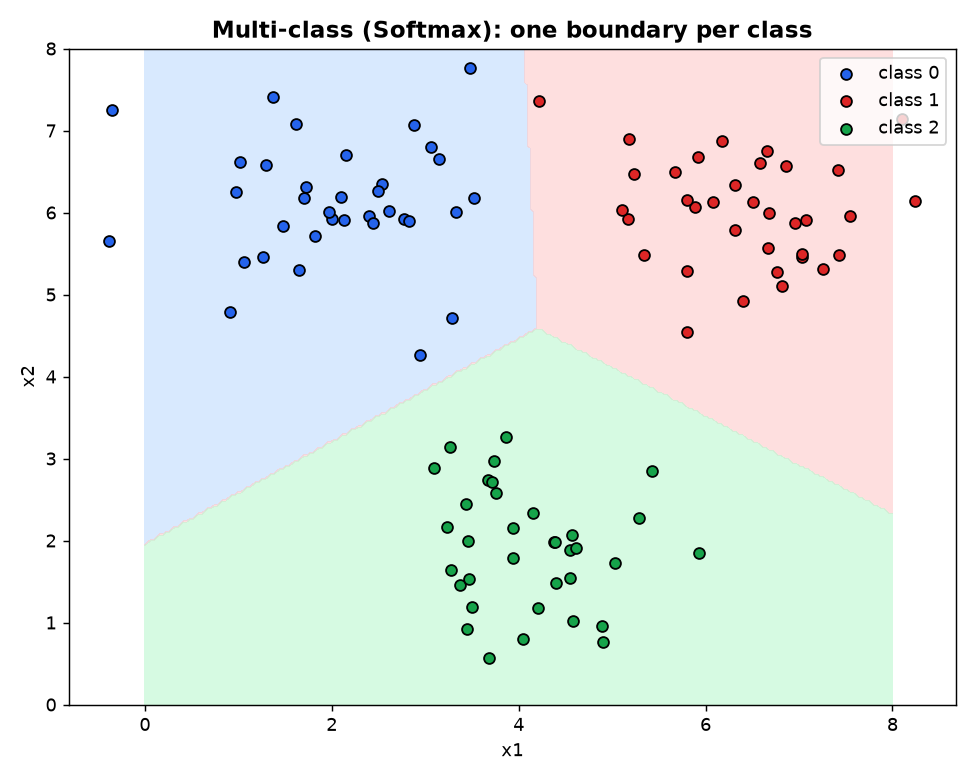
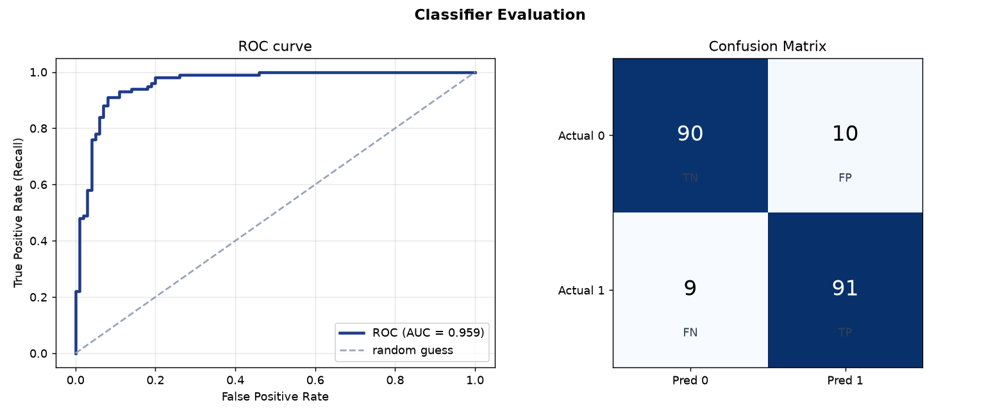

# Module 4 — Linear Models for Classification
### A Beginner's Deep-Dive Study Guide (BITS AIML ZG565 — Contact Sessions 4 & 5)

> **Handout, Session 4:** *Discriminant Functions, Decision Theory, Probabilistic Discriminative Classifiers, Introduction to Logistic Regression* → **R1 (Bishop) Ch.3–4**.
> **Handout, Session 5:** *Logistic Regression — Log-loss Function, Gradient Descent, Multi-class classification* → **R1 Ch.4, R2 Ch.4**.
> **Note:** your folder has slide PDFs only for Modules 1–3. This guide is built from the **handout topic list + Bishop Ch.3–4 + standard course material**, in the same format as your Module 1–3 guides.

---

## How to use this guide
Same recipe: **plain idea → definition → mental map → worked example → runnable Python.**
Diagrams: `module4_images/`. Runnable, verified code: `module4_examples.py`.
Builds on Module 3 (linear models + gradient descent) and Module 2's math (dot products, probability, decision theory, entropy/cross-entropy).

> 🧠 **The whole module in one line:** *Reuse the linear score `z = w·x + b`, but instead of predicting a number, squash it through the **sigmoid** into a **probability**, then pick a class — and train it by minimising **log-loss** with gradient descent.*

---

## Table of Contents
1. [Classification vs Regression — the setup](#1-setup)
2. [Three ways to approach classification](#2-three-approaches)
3. [Discriminant Functions & the decision boundary](#3-discriminant)
4. [Decision Theory (turning probabilities into actions)](#4-decision-theory)
5. [Logistic Regression & the Sigmoid](#5-logistic)
6. [The Log-Loss (Cross-Entropy) cost](#6-logloss)
7. [Training with Gradient Descent](#7-gradient-descent)
8. [Multi-class classification (OvR & Softmax)](#8-multiclass)
9. [Regularization](#9-regularization)
10. [Evaluating a classifier (confusion matrix, ROC/AUC)](#10-evaluation)
11. [Glossary + Self-check](#11-glossary)

---

<a name="1-setup"></a>
## 1. Classification vs Regression — the setup

Both are **supervised** (learn from labelled `(x, y)` pairs). The only difference is what `y` is:

| | Regression (Module 3) | **Classification (Module 4)** |
|---|---|---|
| Output y | a **number** (₹, °C) | a **category/class** (spam/ham, 0/1) |
| Question | "how much?" | "which class?" |
| Example | predict house price | predict pass/fail |

**Formal goal:** given `(x₁,y₁),…,(xₙ,yₙ)` where `y` is a class label, learn `f(x)` that assigns the correct class to an unseen `x`.
- **Binary** classification: 2 classes (y ∈ {0,1}).
- **Multi-class**: K classes (y ∈ {0,1,…,K−1}).

---

<a name="2-three-approaches"></a>
## 2. Three ways to approach classification (Bishop's taxonomy)

This framing helps you place every classifier you'll ever meet:

```
                          ┌─────────────────────────────────────────────┐
   1. DISCRIMINANT        │ learn a function that directly outputs the   │  e.g. perceptron,
      FUNCTION            │ class label (a hard boundary, no probability)│  linear discriminant
                          └─────────────────────────────────────────────┘
                          ┌─────────────────────────────────────────────┐
   2. PROBABILISTIC       │ model P(class | x) directly, then decide     │  e.g. LOGISTIC
      DISCRIMINATIVE      │ (learn the boundary + a confidence)          │  REGRESSION  ← this module
                          └─────────────────────────────────────────────┘
                          ┌─────────────────────────────────────────────┐
   3. PROBABILISTIC       │ model P(x | class) & P(class), use Bayes to  │  e.g. Naive Bayes
      GENERATIVE          │ get P(class | x)                             │  (Module 8)
                          └─────────────────────────────────────────────┘
```
- **Discriminative** (this module) = "just learn the boundary between classes."
- **Generative** (Module 8) = "learn what each class *looks like*, then compare."

Logistic regression is the flagship **probabilistic discriminative** classifier.

---

<a name="3-discriminant"></a>
## 3. Discriminant Functions & the decision boundary

A **discriminant function** takes `x` and outputs a score that decides the class. The simplest is **linear**:
```
   z = w·x + b = w₁x₁ + w₂x₂ + … + w_d x_d + b
   predict class 1 if z > 0,  else class 0
```
The set of points where `z = 0` is the **decision boundary** — a **hyperplane** (a line in 2-D, a plane in 3-D).



**Geometry to remember:**
- **w** is the **normal vector** — it points perpendicular to the boundary, toward the positive class.
- `b` (bias) shifts the boundary away from the origin.
- Moving in the direction of `w` increases `z` → more confident it's class 1.

**✍️ Worked:** `w=[1,1]`, `b=−6` → boundary `x₁ + x₂ = 6`.
- Point (5,4): z = 5+4−6 = **3 > 0** → class 1.
- Point (1,2): z = 1+2−6 = **−3 < 0** → class 0.

> **"Linear classifier"** just means the boundary is a straight hyperplane. If classes aren't linearly separable, we add basis functions (Module 3 trick) or move to SVM/kernels (Module 7).

---

<a name="4-decision-theory"></a>
## 4. Decision Theory — from probabilities to the best action

(Deepened from Module 2.) Once we have `P(class | x)`, how do we **decide**?

### Rule 1 — minimise error: pick the most probable class
```
   choose class k*  =  argmax_k  P(class_k | x)
```
For binary: predict 1 if `P(y=1|x) > 0.5`, else 0. This minimises the **misclassification rate**.

### Rule 2 — minimise expected loss (when mistakes cost differently)
A **false negative** (miss a cancer) may cost far more than a **false positive** (extra test). Encode costs in a **loss matrix** and minimise **expected loss (risk)**:
```
   expected loss of predicting class a  =  Σ_k  Loss(a, k) · P(class_k | x)
   → choose the action with the smallest expected loss
```
**✍️ Worked (medical):** miss-disease cost = 100, false-alarm cost = 1, and `P(disease|x)=0.10`.
- Predict "healthy": risk = 100·0.10 = **10**
- Predict "disease": risk = 1·0.90 = **0.9** → **predict disease** even though it's only 10% likely. High miss-cost **moves the threshold** below 0.5.

### The reject option
If the top probability isn't confident enough (e.g. < 0.6), **abstain / defer to a human** — common in medical & fraud systems.

---

<a name="5-logistic"></a>
## 5. Logistic Regression & the Sigmoid

> Despite the name, logistic **regression** is a **classification** algorithm. It's Module 3's linear model + a squashing function.

### The problem with using linear regression for 0/1 labels
A straight line `w·x+b` outputs any real number (−∞…+∞) and can give "probabilities" like 1.7 or −0.3 — nonsense. We need outputs in **[0, 1]**.

### The fix: the Sigmoid (logistic) function
Squash the linear score `z` into a valid probability:
```
                1
   σ(z) = ───────────        (always between 0 and 1)
            1 + e^(−z)
```



Properties (why it's perfect here):
- `z → +∞` ⇒ σ → 1 ; `z → −∞` ⇒ σ → 0 ; **`z = 0` ⇒ σ = 0.5** (the boundary).
- Smooth & differentiable (needed for gradient descent). Handy fact: `σ'(z) = σ(z)(1−σ(z))`.

### The model
```
   P(y=1 | x) = σ(w·x + b)
   predict 1 if P ≥ 0.5  (i.e. z ≥ 0),  else 0
```
The boundary is still **linear** (`z=0`), but now every point also gets a **confidence**.



**✍️ Worked — predict "pass" from hours studied.** Suppose learned `w=1.5`, `b=−4` (boundary at x = 4/1.5 ≈ 2.67 h):
| hours x | z = 1.5x − 4 | σ(z) = P(pass) | predict |
|---|---|---|---|
| 1 | −2.5 | 0.076 | Fail |
| 3 | 0.5 | 0.622 | Pass |
| 5 | 3.5 | 0.971 | Pass |

```python
import numpy as np
sigmoid = lambda z: 1/(1+np.exp(-z))
for x in (1,3,5):
    z = 1.5*x - 4
    print(x, round(z,2), round(sigmoid(z),3))
```

### Odds & the logit (nice-to-know intuition)
`z = w·x+b` is the **log-odds** (logit): `z = ln( P(y=1) / P(y=0) )`. So each weight `wⱼ` says *how much the log-odds change per unit of feature j* — logistic regression is a linear model **in log-odds space**.

---

<a name="6-logloss"></a>
## 6. The Log-Loss (Cross-Entropy) cost

**Why not reuse MSE?** With the sigmoid inside, MSE becomes **non-convex** (bumpy, many local minima) — gradient descent gets stuck. We need a convex cost. Enter **log-loss** (a.k.a. **binary cross-entropy**), which comes straight from Module 2's information theory:

```
   Loss for one example:
       −log(p)      if the true label y = 1
       −log(1 − p)  if the true label y = 0
   where p = P(y=1|x) = σ(w·x+b)

   Combined (single formula):
       loss = −[ y·log(p) + (1−y)·log(1−p) ]

   Total cost over n examples:
                1   n
       J(w) = − ─── Σ [ yᵢ·log(pᵢ) + (1−yᵢ)·log(1−pᵢ) ]
                n  i=1
```



**Reading the picture — it punishes confident wrong answers:**
- True `y=1`, predict `p=0.9` → loss `−log(0.9) = 0.105` (small, good). ✔
- True `y=1`, predict `p=0.1` → loss `−log(0.1) = 2.303` (**huge**, "how dare you be so wrong and so confident"). ✘
- Perfect prediction (`p=1` for `y=1`) → loss 0.

This cost is **convex** in `w`, so gradient descent reliably finds the global minimum. (Cross-entropy = the same measure of "surprise" from information theory.)

---

<a name="7-gradient-descent"></a>
## 7. Training with Gradient Descent

We minimise `J(w)` exactly like Module 3 — walk downhill. **Beautiful surprise:** the gradient of log-loss has the *same clean shape* as linear regression's:
```
   wⱼ ← wⱼ − η · (1/n) Σ ( σ(w·xᵢ+b) − yᵢ ) · xᵢⱼ
   b  ← b  − η · (1/n) Σ ( σ(w·xᵢ+b) − yᵢ )
```
Read: *"(predicted probability − actual label) × feature, averaged, scaled by η."* Same **LMS pattern** as Modules 1 & 3 — only `h(x)` changed from a line to a sigmoid. There is **no closed-form** solution for logistic regression, so gradient descent (or similar) is required.

**✍️ Worked one step.** Data: (x=1,y=0),(x=2,y=0),(x=3,y=1),(x=4,y=1). Start `w=0, b=0`, `η=0.1`.
- With w=b=0, every `z=0` so `p=σ(0)=0.5` for all.
- errors `(p−y) = (0.5, 0.5, −0.5, −0.5)`.
```
grad_b = (1/4)(0.5+0.5−0.5−0.5)          = 0     → b stays 0
grad_w = (1/4)(0.5·1+0.5·2−0.5·3−0.5·4)  = (1/4)(0.5+1−1.5−2)= −0.5
w ← 0 − 0.1·(−0.5) = 0.05   → w grows, boundary starts separating the classes ✔
```
(All batch/mini-batch/stochastic variants from Module 3 apply here too.)

---

<a name="8-multiclass"></a>
## 8. Multi-class classification (K > 2 classes)

Two standard ways to extend the binary classifier:

### (a) One-vs-Rest (OvR / One-vs-All)
Train **K separate binary classifiers**, each "class k vs everything else." To predict, run all K and pick the one with the **highest score**.
```
   class A vs (B,C) →  P_A
   class B vs (A,C) →  P_B     → predict argmax(P_A, P_B, P_C)
   class C vs (A,B) →  P_C
```

### (b) Softmax (Multinomial logistic regression)
One model with a weight vector per class; convert K scores into K probabilities that **sum to 1**:
```
                 e^(z_k)
   P(y=k|x) = ───────────────         (z_k = w_k·x + b_k)
               Σⱼ e^(z_j)
   predict argmax_k P(y=k|x)
```
Softmax is the natural generalisation of the sigmoid to many classes (its loss is **categorical cross-entropy**).



**✍️ Worked softmax:** scores `z = [2.0, 1.0, 0.1]`:
```
e^z = [7.389, 2.718, 1.105],  sum = 11.213
P   = [0.659, 0.242, 0.099]   → predict class 0 (highest)
```

---

<a name="9-regularization"></a>
## 9. Regularization (shared with Module 3)

Logistic regression can **overfit** too (especially with many features). Add the same penalties on weight size to the log-loss cost:
```
   J(w) = log-loss  +  λ · penalty
     L2 (Ridge-style):  λ Σ wⱼ²   → shrinks weights (smoother boundary)
     L1 (Lasso-style):  λ Σ |wⱼ|  → zeroes weights → feature selection
```
> In **scikit-learn**, `LogisticRegression` is regularized **by default**; the strength is `C = 1/λ` (so **smaller C = stronger** regularization). Set `penalty='l1'`, `'l2'`, or `'elasticnet'`.

```python
from sklearn.linear_model import LogisticRegression
LogisticRegression(C=0.5, penalty="l2")   # smaller C -> more regularization
```

---

<a name="10-evaluation"></a>
## 10. Evaluating a classifier

Accuracy alone is misleading on **imbalanced** data (Module 2). Use the **confusion matrix** and the metrics built on it.



```
                 Predicted 0     Predicted 1
   Actual 0        TN              FP
   Actual 1        FN              TP
```
| Metric | Formula | Reads as |
|---|---|---|
| **Accuracy** | (TP+TN)/all | overall % correct |
| **Precision** | TP/(TP+FP) | of predicted-positive, how many right |
| **Recall (TPR)** | TP/(TP+FN) | of actual-positive, how many caught |
| **F1** | 2PR/(P+R) | balance of precision & recall |

### The decision threshold, ROC & AUC
Logistic regression outputs a **probability**; the 0.5 cutoff is a *choice*. Sliding the threshold trades precision vs recall.
- **ROC curve:** plots **True Positive Rate vs False Positive Rate** as the threshold varies.
- **AUC (Area Under Curve):** single number, **1.0 = perfect**, **0.5 = random guessing**. Higher = better ranking of positives above negatives.

**✍️ Worked (spam, from Module 2):** 100 emails, 20 spam; model gives TP=15, FP=3, FN=5, TN=77.
```
Accuracy = 92/100 = 0.92 ,  Precision = 15/18 = 0.833
Recall   = 15/20 = 0.75  ,  F1 = 2·0.833·0.75/(0.833+0.75) = 0.79
```

---

<a name="11-glossary"></a>
## 11. Glossary + Self-check

**Glossary**
- **Classification:** predict a discrete class. **Binary / Multi-class:** 2 / K classes.
- **Discriminant function:** score function whose sign gives the class.
- **Decision boundary / hyperplane:** where `w·x+b = 0`.
- **Discriminative vs Generative:** learn P(class|x) directly vs model P(x|class)+Bayes.
- **Sigmoid σ(z)=1/(1+e⁻ᶻ):** squashes score to a probability; σ(0)=0.5.
- **Logistic regression:** `P(y=1|x)=σ(w·x+b)`; linear boundary + confidence.
- **Logit / log-odds:** `z = ln(P/(1−P))`; the linear part.
- **Log-loss / cross-entropy:** convex classification cost; punishes confident errors.
- **Gradient descent update:** `w ← w − η·(σ(z)−y)·x` (same LMS shape).
- **Softmax:** multi-class sigmoid; probabilities sum to 1.
- **One-vs-Rest:** K binary classifiers, pick the max.
- **Regularization (L1/L2), C=1/λ:** control overfitting; smaller C = stronger.
- **Confusion matrix / Precision / Recall / F1:** threshold-based metrics.
- **ROC / AUC:** threshold-independent ranking quality; 1=perfect, 0.5=random.

**Self-check (try, then peek)**
1. **Q:** Why squash the linear score with a sigmoid? **A:** To turn any real score into a valid probability in [0,1].
2. **Q:** `w=[2,−1]`, `b=−1`, point (2,1): class? **A:** z=4−1−1=2>0 → class 1.
3. **Q:** Why log-loss instead of MSE for logistic regression? **A:** MSE+sigmoid is non-convex; log-loss is convex → GD finds the global min.
4. **Q:** True y=1, predicted p=0.2 — is the loss big or small? **A:** Big (−log 0.2 ≈ 1.61) — confident and wrong.
5. **Q:** Does logistic regression have a closed-form solution? **A:** No; train with gradient descent (or similar).
6. **Q:** Softmax of scores [1,3,0]? **A:** e≈[2.72,20.09,1], sum≈23.81 → ≈[0.114,0.844,0.042] → class 1.
7. **Q:** AUC = 0.5 means? **A:** The classifier is no better than random guessing.
8. **Q:** In sklearn, does larger C mean more or less regularization? **A:** Less (C = 1/λ).

### ✅ 30-second recap
- Classification predicts a **class**; the linear boundary is `w·x+b = 0` (a **hyperplane**).
- **Logistic regression** = `σ(w·x+b)` → a **probability**; threshold at 0.5 (or shift it via **decision theory** when costs differ).
- Train by minimising **log-loss (cross-entropy)** with **gradient descent** (`w ← w − η(σ(z)−y)x`), no closed form.
- Go multi-class with **Softmax** or **One-vs-Rest**.
- Control overfitting with **L1/L2 regularization** (`C=1/λ`).
- Evaluate with **confusion-matrix metrics** and **ROC/AUC**, not just accuracy.

*Next up: Module 5 — Decision Trees (entropy, information gain, overfitting/pruning, MDL).*
